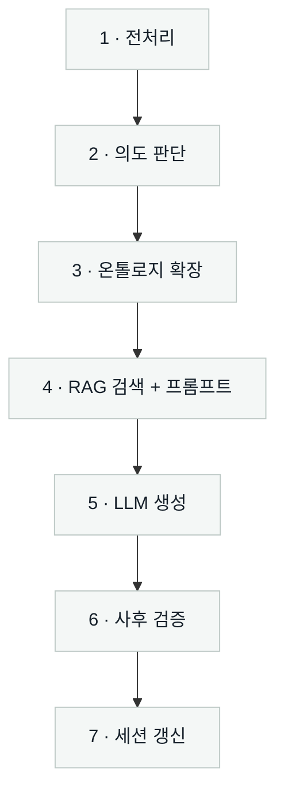
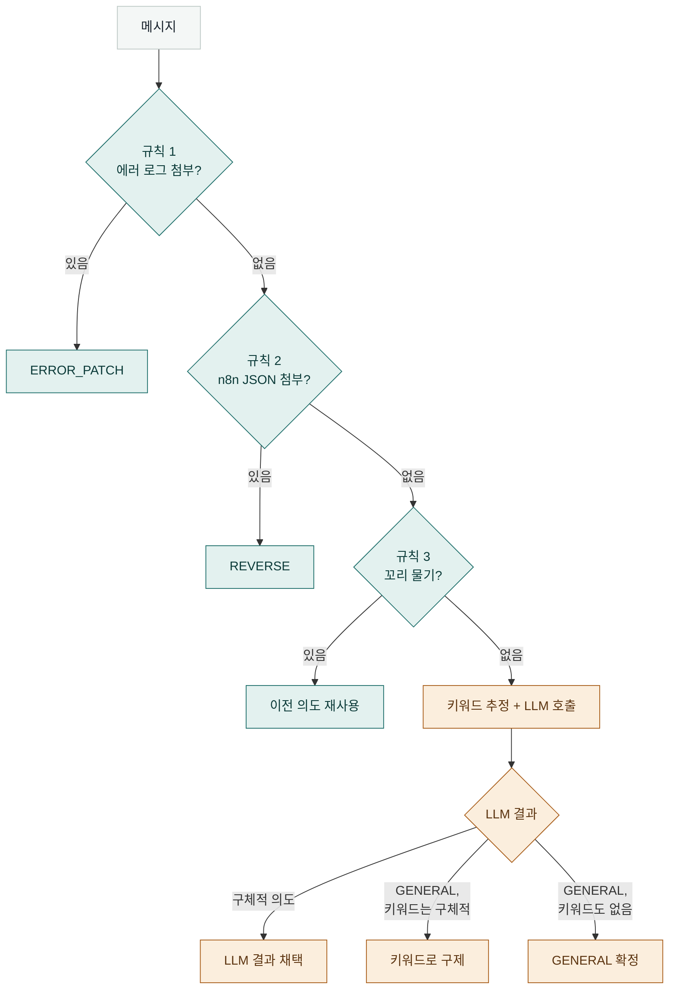
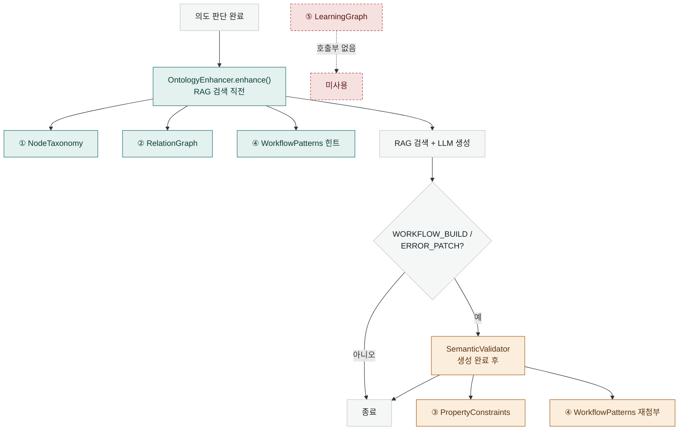
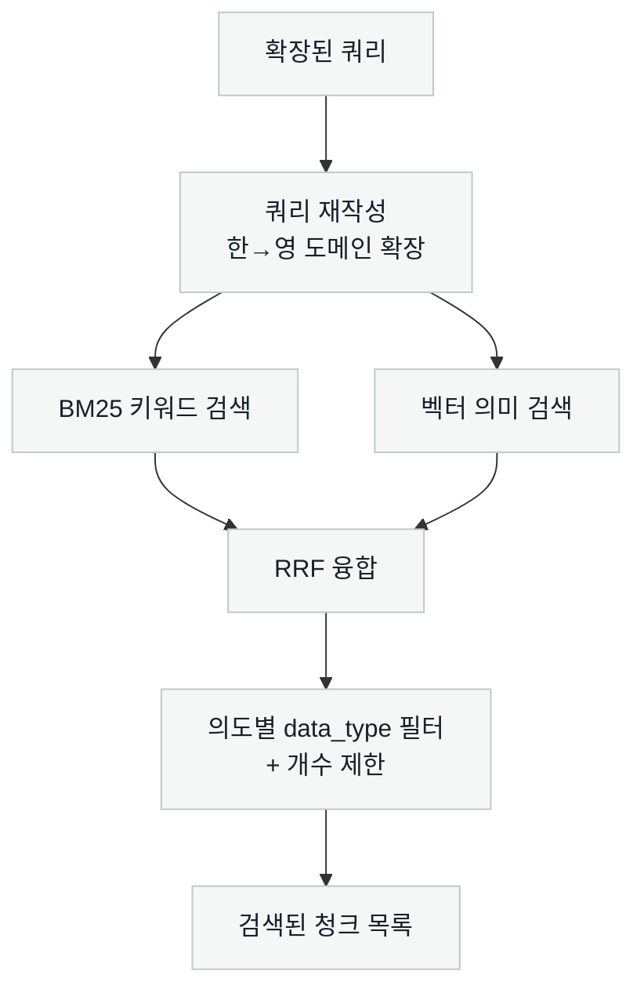
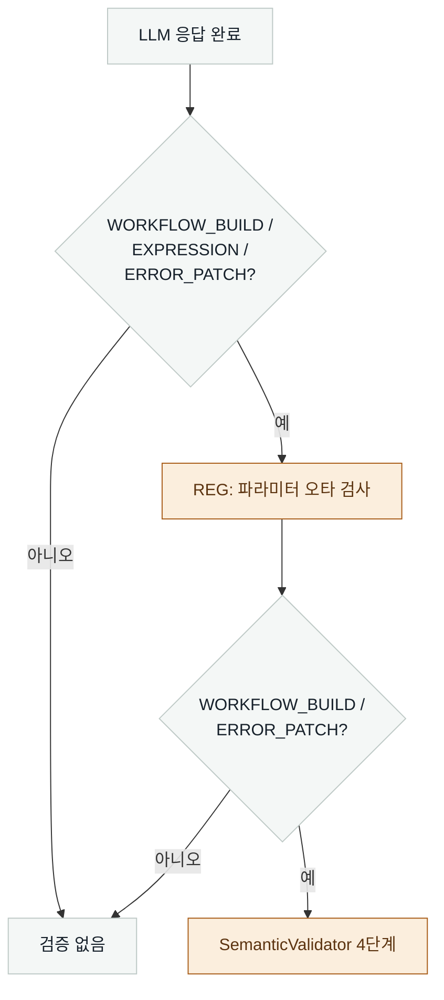

# Naito 서버 처리 로직

> FastAPI 서버(`server/workspace.py` 및 관련 모듈)가 메시지 하나를 받아 처리하는 내부 로직만 다룹니다. 웹 프론트엔드(Next.js)·인증·DB 저장 같은 레이어는 다루지 않습니다. 모든 내용은 `server/*.py`, `domain_ontology.py` 실제 소스코드 기준입니다.

---

## 전체 흐름

메시지 하나가 들어오면 서버는 아래 7단계를 순서대로 거칩니다.

1. **전처리** — 요청에서 메시지 텍스트를 꺼내고, 함께 첨부된 노드 데이터·에러 로그·워크플로우 JSON에서 API 키 같은 자격증명을 마스킹합니다.
2. **의도 판단** — 이 메시지가 커리큘럼·표현식·워크플로우 생성·에러 수정·역분석·일반 질문 중 무엇인지 정합니다. (아래 1절)
3. **온톨로지 확장** — 메시지에 등장한 n8n 노드를 감지하고, 그 노드와 관련된 다른 노드·주의사항·검증된 패턴을 자동으로 덧붙입니다. (아래 2절)
4. **RAG 검색 + 프롬프트 구성** — 2단계에서 정한 의도별로 검색 범위를 좁혀서, 지식창고에서 키워드 검색(BM25)과 벡터 검색을 동시에 돌리고 결과를 합칩니다. 여기에 3단계에서 만든 힌트와 이전 대화 이력을 더해 LLM에게 넘길 지시문을 완성합니다. (아래 3절)
5. **LLM 생성** — Ollama(자체 서버) 또는 사용자가 입력한 OpenAI 키로 답변을 실시간으로 스트리밍 생성합니다.
6. **사후 검증** — LLM이 만든 답을 다시 한번 검사합니다. 파라미터 오타를 자동으로 고치고, 워크플로우 구조와 제약 조건을 대조합니다. (아래 4절)
7. **세션 갱신** — 이번 턴의 질문과 답변을 서버 메모리(세션 스토어)에 저장합니다. 다음 메시지가 "그거 더 설명해줘" 같은 짧은 후속 질문이면, 이 저장된 내용을 보고 이전 의도를 그대로 이어받거나 대화 맥락을 검색 쿼리에 보탭니다.

---

## 1. 의도 판단 로직

가장 먼저, 문장을 이해할 필요 없이 판단 가능한 **명백한 신호 3가지**를 순서대로 확인합니다. 하나라도 걸리면 그 즉시 확정하고 나머지는 확인하지 않습니다.

- **규칙 1 — 에러 로그 첨부:** `error_log` 필드에 "error", "exception", "실패" 같은 패턴이 있으면 무조건 `ERROR_PATCH`로 확정합니다. 메시지 내용이 뭐든 상관없습니다.
- **규칙 2 — n8n JSON 첨부:** 메시지나 첨부 데이터에 `"connections":` 형태의 문자열(n8n 워크플로우 JSON의 특징적인 키)이 있으면 `REVERSE`(역분석)로 확정합니다.
- **규칙 3 — 꼬리 물기 질문:** "더 자세히", "그거", "방금" 같은 짧은 후속 질문 패턴이고 이전 대화가 있으면, 이전 턴에서 판단했던 의도를 그대로 재사용합니다.

이 3가지에 해당하지 않는 **대부분의 자연어 질문**은 여기서 판단이 안 갈립니다. 예를 들어 "Webhook 노드 설명해줘"(일반 질문)와 "이 워크플로우 어떻게 동작해?"(특정 대상 분석)는 표면적으로 비슷하지만 의미가 다른데, 정규식만으로는 이런 경계 케이스를 안정적으로 못 가릅니다. 그래서 이 경우엔 두 가지를 동시에 계산합니다.

- **키워드 추정** — "만들어줘"+"워크플로우"가 같이 있으면 `WORKFLOW_BUILD`, "커리큘럼"/"로드맵"이 있으면 `CURRICULUM` 같은 식으로 몇 개 단어만 보는 가벼운 판단. 매칭이 없으면 `None`을 반환합니다(“GENERAL이다”라고 단정하지 않습니다).
- **LLM 분류 호출** — 판단 기준 예시(few-shot)를 포함한 프롬프트로 LLM에게 6개 의도 중 하나를 고르게 합니다.

두 결과를 합칠 때는 이런 순서로 판단합니다: LLM이 구체적인 의도를 답했으면 그대로 채택합니다. LLM이 애매해서 `GENERAL`로 답했는데 키워드 추정은 구체적인 의도를 가리키고 있으면, 키워드 쪽으로 바꿔서 확정합니다(LLM이 "모르겠다"고 회피한 걸 구제하는 것). LLM 호출 자체가 실패했을 때만(네트워크 오류 등) 키워드 추정 결과로 완전히 대체하고, 그마저 없으면 `GENERAL`로 확정합니다.

> 처음엔 이 판단을 전부 정규식(규칙)으로만 만들었다가, 위와 같은 오분류가 반복돼서 지금 구조(규칙 3종 + LLM + 키워드 안전망)로 바꿨습니다.

---

## 2. 온톨로지 로직 — 5계층

n8n 도메인 지식은 `domain_ontology.py` 안에 5개 계층으로 나뉘어 정의되어 있습니다. 그런데 이 파일을 실제로 가져다 쓰는(import하는) 파일은 서버 전체에서 `ontology_enhancer.py`와 `semantic_validator.py` 딱 두 개뿐입니다. 어느 계층이 언제 실행되는지는 결국 이 두 파일이 무엇을, 언제 호출하느냐로 정해집니다.

### ① NodeTaxonomy — 노드 이름을 통일하는 사전

의도 판단이 끝난 직후, RAG 검색을 하기 전에 `OntologyEnhancer.enhance()` 안에서 실행됩니다. 이 함수는 453개 n8n 노드를 `short_type`(예: `httpRequest`), `full_type`(`n8n-nodes-base.httpRequest`), `display_name`(`HTTP Request`) 세 가지 이름으로 찾을 수 있는 사전 역할을 합니다.

메시지에서 노드를 찾는 과정은 두 단계입니다. 먼저 정확한 타입 문자열, 영어 이름, 한국어 키워드 사전("웹훅"→webhook, "슬랙"→slack 등)으로 정확히 일치하는지 봅니다. 여기서 하나도 못 찾았을 때만, 오타를 감안한 근사 매칭으로 넘어갑니다 — 한글은 자모 단위로 분해하고, 영어는 문자 단위로 분해해서 편집 거리(Levenshtein distance)를 계산합니다. 예를 들어 "앱훅"이라고 오타를 쳐도 자모 분해 후 "웹훅"과의 편집 거리가 1이라 `webhook`으로 인식하고, 이 교정 사실을 별도로 기록해서 나중에 LLM에게 "이건 오타니까 새로운 개념으로 착각하지 마라"고 알려줍니다.

주의할 점은, 워크플로우를 역분석하는 `ReverseService`(`feature_services.py`)는 이 사전을 쓰지 않는다는 것입니다. 이 파일은 `domain_ontology`를 아예 import하지 않고, trigger 5개·sink 6개짜리 훨씬 작은 목록을 자체적으로 하드코딩해서 따로 분류합니다.

### ② RelationGraph — 관련 지식을 자동으로 끌어오기

노드를 감지한 직후, 같은 함수(`OntologyEnhancer.enhance()`) 안에서 이어서 실행됩니다. 노드들 사이의 관계를 7종류(`COMMONLY_USED_WITH`, `ANTI_PATTERN_WITH`, `COMPLEMENTED_BY` 등)로, 각각 0~1 사이의 가중치와 함께 그래프로 갖고 있습니다. 예를 들어 `httpRequest`는 `Set`과 0.90의 가중치로 "자주 같이 쓰임" 관계이고, `Code` 노드와는 0.40의 가중치로 "위험한 조합"(anti-pattern) 관계입니다. 감지된 노드에서 가중치 0.75 이상인 관계만 골라 관련 노드의 이름과 태그를 검색 쿼리에 덧붙이고, 위험한 조합이나 필수 파트너 관계는 "이 노드를 쓸 땐 이것도 같이 고려하라"는 힌트 문장으로 만들어 LLM 프롬프트에 그대로 삽입합니다.

### ③ PropertyConstraints — 생성된 결과를 스펙과 대조하는 감사관

RAG 검색과는 완전히 다른 시점에 실행됩니다 — LLM이 답변을 다 스트리밍하고 난 **이후**, 그리고 `WORKFLOW_BUILD`나 `ERROR_PATCH` 의도일 때만 실행됩니다. 나머지 의도에서는 이 검사 자체가 실행되지 않습니다. LLM이 만들어낸 워크플로우 JSON을 파싱해서 노드마다 관련된 제약 규칙(총 30개)을 찾아 대조합니다. 규칙은 네 종류입니다: A를 설정하면 B도 반드시 있어야 하는 경우(REQUIRES, 예: `retryOnFail: true`면 `maxTries` 필수), A가 특정 값일 때만 B가 필요한 경우(CONDITIONAL), 필수는 아니지만 권장하는 경우(RECOMMENDED), 그리고 아예 쓰면 안 되는 폐기된 문법(FORBIDDEN, 예: n8n v1.x에서 사라진 `$item()`). 위반이 발견되면 심각도(에러/경고/정보)와 함께 검증 결과 목록에 담깁니다.

### ④ WorkflowPatterns — 생성 전과 생성 후, 두 번 쓰이는 유일한 계층

11개의 검증된 노드 조합 패턴(예: "주기적 API 모니터링" = Schedule Trigger→HTTP Request→IF→Slack)이 정의되어 있고, 이건 다른 계층과 달리 **두 번, 서로 다른 목적으로** 조회됩니다.

첫 번째는 RAG 검색 시점입니다. 감지된 노드 조합이 알려진 패턴과 일치하면, 그 패턴의 모범 사례와 피해야 할 조합을 프롬프트에 힌트로 삽입해서 LLM이 애초에 좋은 답을 만들도록 유도합니다.

두 번째는 생성 완료 후, 검증 단계입니다. 여기서도 같은 패턴 매칭 함수를 다시 호출하지만, 이번엔 위반 여부를 판단하는 게 아니라 그 패턴의 모범 사례를 검증 결과에 참고용으로 첨부하기만 합니다. 실제로 "이 조합이 위험하다"고 판정하는 건 별개의 로직입니다 — 검증 단계의 "관계 패턴 검증"이라는 이름이 붙은 부분은 `WorkflowPattern` 데이터를 조회하지 않고, Merge 노드에 입력이 2개 미만인지, Webhook을 쓰면서 Respond to Webhook 노드가 빠졌는지, Code 노드 안에서 `fetch()`를 직접 호출했는지 — 이 세 가지를 각각 하드코딩된 문자열 검사로 따로 확인합니다. 이름과 실제 구현이 정확히 일치하진 않는 지점입니다.

### ⑤ LearningGraph — 정의는 있지만 연결되지 않은 층

"이 개념을 배우려면 이 개념을 먼저 알아야 한다"는 선행 관계를 17개 노드로 정의해 둔 그래프입니다(예: AI 연동을 배우려면 API 호출과 데이터 변환을 먼저 알아야 함). 하지만 이 그래프를 조회하는 함수(`get_learning_prerequisites`)를 호출하는 코드가 서버 어디에도 없습니다. 커리큘럼을 실제로 만드는 `CurriculumService`는 `domain_ontology`를 아예 import하지 않고, 완전히 별개로 자기만의 정규식으로 사용자 레벨(초급/중급/고급)을 감지하고, 레벨에 맞는 문서만 검색하고, LLM에게 주차별 로드맵을 자유 형식으로 생성하게 시킵니다. 즉 지금 커리큘럼은 "레벨에 맞는 문서를 찾아서 LLM이 알아서 구성하는" 방식이지, "선행 개념 그래프를 따라 순서를 강제하는" 방식이 아닙니다. 이 계층은 만들어져 있지만 아직 아무 데도 연결되지 않은 상태입니다.

---

## 3. RAG 검색 + 프롬프트 구성 로직

실제 검색 엔진(`HybridRetriever`)은 프로젝트 루트의 `query_engine.py`에 있고, `server/engine.py`가 서버 기동 시 한 번만 초기화해 이후 모든 요청이 재사용합니다.

**검색 전 — 쿼리 재작성.** 한국어 질문을 영어 도메인 용어로 확장합니다. `query_rewrite.py`의 사전(`_DOMAIN_MAP`)이 "웹훅"→"webhook trigger", "수식"→"expression $json" 같은 매핑을 갖고 있고, 불용어(을/를/이/가 등)를 제거한 한국어(`ko_clean`)와 이 영어 확장(`en_expanded`)을 합친 `combined` 쿼리를 만듭니다. 검색에는 이 `combined`가 쓰입니다.

**검색 — 두 방식을 동시에 돌리고 합칩니다.**

- **BM25(키워드) 검색**: 청크 텍스트를 한글/영문 토큰으로 쪼개 정확한 단어 일치를 봅니다. 점수가 비슷하면 `_rank_key()`가 한 번 더 정렬하는데, 쿼리 토큰이 청크의 노드 이름과 일치하면 가중치를 3배 주고, `official_docs`나 `spec` 타입이면 소폭 가산점을 줍니다.
- **벡터(의미) 검색**: 쿼리를 BGE-M3 임베딩 모델(Ollama)로 벡터화해서 ChromaDB에서 코사인 유사도로 찾습니다. 표현이 달라도 의미가 같으면 잡아냅니다("자동으로 반복 처리" ↔ "Loop Over Items").
- **RRF(Reciprocal Rank Fusion)로 합치기**: 두 결과의 등수를 `1/(60+등수+1)` 공식으로 점수화해서 더합니다. 한쪽 방식에서만 상위에 있어도 최종 순위에 반영됩니다.

**검색 후 — 의도별로 좁히기.** 합쳐진 결과를 `data_type`(spec / troubleshooting / official_docs 등)으로 한 번 더 걸러내고, 의도마다 미리 정해둔 개수만 가져갑니다.

| 의도 | 필터 | 개수 |
|---|---|---|
| CURRICULUM | 레벨별(초급/중급/고급) 문서 타입 | 12 |
| EXPRESSION | spec, cli_spec, official_docs | 6 |
| WORKFLOW_BUILD | spec, official_docs | 계획의 각 단계마다 4개씩 별도 검색 |
| ERROR_PATCH | troubleshooting, api_limits, spec | 8 |
| REVERSE | spec, official_docs | 10 |
| GENERAL | 노드 질문이면 spec 전용 인덱스, 아니면 필터 없음 | 8 |

BM25 연산은 CPU를 많이 쓰기 때문에 `ProcessPoolExecutor`라는 별도 프로세스에서 돌립니다 — 그래야 검색하는 동안에도 서버가 다른 요청을 동시에 처리할 수 있습니다. 별도 프로세스 실행이 실패하면 스레드로 대체합니다.

> **확인된 사실:** `OntologyEnhancer`에는 감지된 노드를 기준으로 검색 결과 순위를 다시 매기는 `rerank_chunks()`(+0.15 가산점) 함수가 정의되어 있지만, 이 함수를 호출하는 코드가 저장소 전체에 없습니다. 2절에서 설명한 "쿼리 확장"(관련 용어를 검색어에 추가하는 것)만 실제로 검색 품질에 기여하고, 검색 결과를 다시 정렬하는 재랭킹 단계는 LearningGraph처럼 만들어져 있지만 연결되지 않았습니다.

**프롬프트 구성.** 검색된 청크를 `[번호][타입] 제목 (출처)\n본문(최대 1500자)` 형식으로 나열해 컨텍스트 문자열을 만듭니다. 의도별로 미리 정해둔 시스템 프롬프트 템플릿(예: 노드 질문이면 "노드 개요 → 주요 파라미터 → 사용 예시 → 연결 패턴 → 주의사항" 5단 고정 구조)에 이 컨텍스트를 채워 넣습니다. 이어서 온톨로지 힌트가 있으면 `[온톨로지 힌트]` 블록을, 오타 교정이 있으면 `[⚠ 오타 자동 교정]` 블록을("오타 단어는 존재하지 않는 개념이니 별도로 설명하지 말라"는 지시와 함께) 시스템 프롬프트 뒤에 덧붙입니다. 이미지가 첨부됐으면 이미지 분석 지침도 추가합니다. 마지막으로 사용자 메시지에 "한국어로, 마크다운으로, 파라미터명은 영문 유지" 같은 출력 형식 지시를 붙여 완성한 뒤 LLM 스트리밍을 시작합니다. 답변이 끝나면 검색에 실제로 쓰인 출처 목록을 별도로 전송해, 어떤 문서를 근거로 답했는지 노출합니다.

---

## 4. 검증 로직

LLM이 답변을 다 생성한 뒤, 의도에 따라 두 가지 검증이 조건부로 실행됩니다. 검색이나 프롬프트 구성에는 전혀 관여하지 않고, 오직 "이미 나온 결과가 맞는지"만 확인하는 사후 감사입니다.

**REG(파라미터 오타 검증)**는 `WORKFLOW_BUILD`, `EXPRESSION`, `ERROR_PATCH` 세 의도에서 실행됩니다. LLM이 생성한 텍스트에서 파라미터 이름을 뽑아, 실제 n8n 공식 스펙 목록과 글자 단위로 비교합니다. 편집 거리가 2 이하면 오타로 판단해 자동으로 올바른 이름으로 고치고, 무엇을 고쳤는지 기록합니다.

**SemanticValidator**는 `WORKFLOW_BUILD`, `ERROR_PATCH` 두 의도에서만, 그것도 LLM 응답에서 워크플로우 JSON을 실제로 추출할 수 있을 때만 실행됩니다. 네 단계로 나뉘어 있습니다: 먼저 JSON 구조 자체가 온전한지(`nodes`, `connections` 필드가 있는지, 연결이 가리키는 노드가 실제로 존재하는지) 봅니다. 그다음 위에서 설명한 PropertyConstraints로 파라미터 논리를 감사합니다. 그다음 Merge/Webhook/Code 세 가지 하드코딩된 패턴을 확인합니다. 마지막으로 답변 텍스트 안에 폐기된 표현식 문법(`$item()`)이나, 워크플로우에 존재하지 않는 노드를 참조하는 표현식이 있는지 봅니다.

REG는 "글자가 맞나"를 보고, SemanticValidator는 "구조와 논리가 맞나"를 봅니다. 둘 다 결과가 있을 때만(에러나 경고가 하나라도 있을 때만) 검증 결과를 만들고, 문제가 없으면 조용히 넘어갑니다.

---

## 요약표

| 로직 | 실행 시점 | 실행 조건 |
|---|---|---|
| 의도 판단 | 요청 최초 | 항상 |
| NodeTaxonomy / RelationGraph | RAG 검색 전 | 노드가 감지될 때 |
| WorkflowPatterns | RAG 검색 전 + 생성 후 두 번 | 노드 조합이 매칭될 때 |
| PropertyConstraints | 생성 완료 후 | `WORKFLOW_BUILD` / `ERROR_PATCH`만 |
| LearningGraph | — | 미사용 |
| RAG 검색 (BM25+벡터+RRF) | 온톨로지 확장 후 | 항상 |
| Ontology 재랭킹(`rerank_chunks`) | — | 미사용 |
| 프롬프트 구성 | RAG 검색 후, LLM 호출 전 | 항상 |
| REG | 생성 완료 후 | `WORKFLOW_BUILD` / `EXPRESSION` / `ERROR_PATCH` |
| SemanticValidator | 생성 완료 후 | `WORKFLOW_BUILD` / `ERROR_PATCH`만 |

*작성: 2026-07 · `server/*.py`, `domain_ontology.py` 실제 소스 기준*
