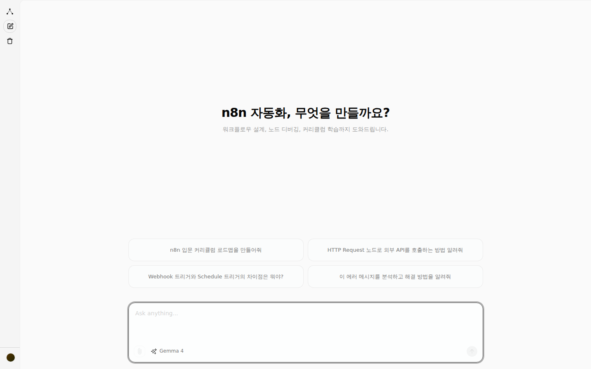
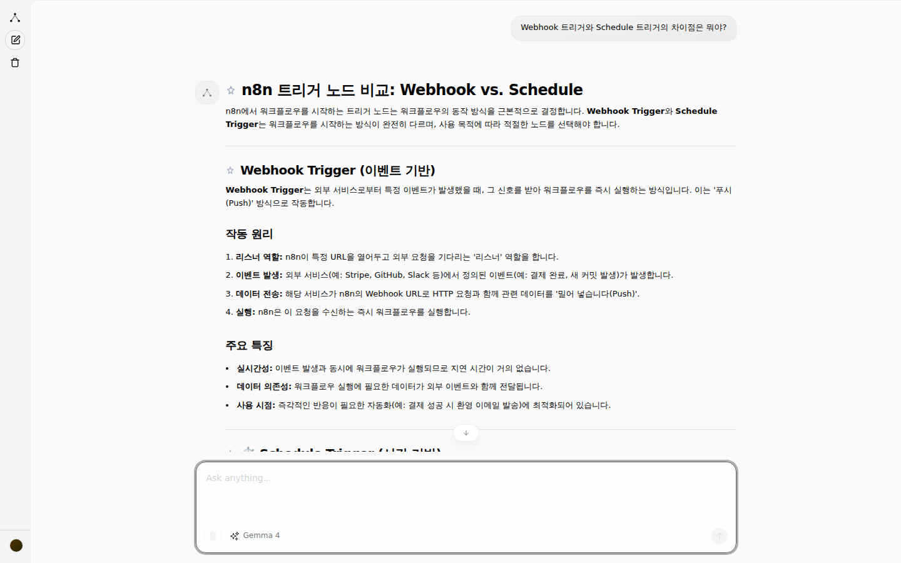
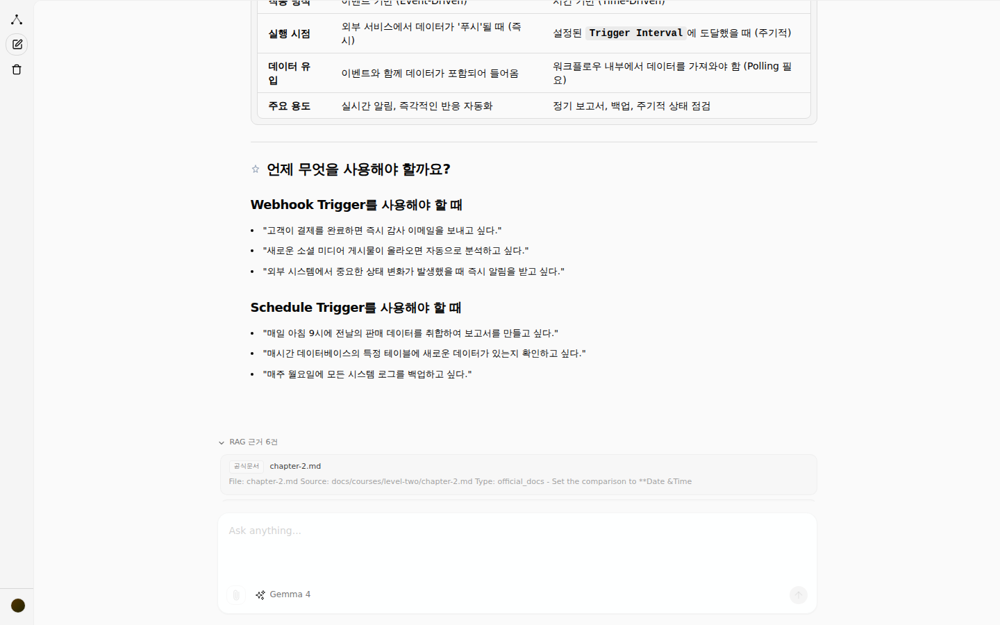
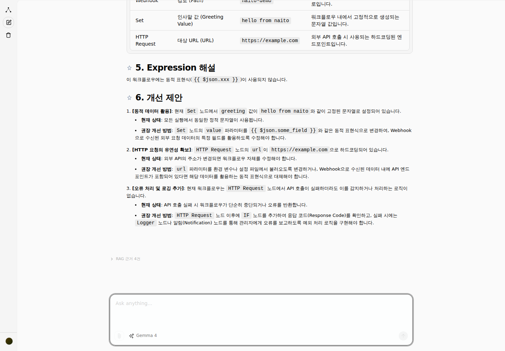
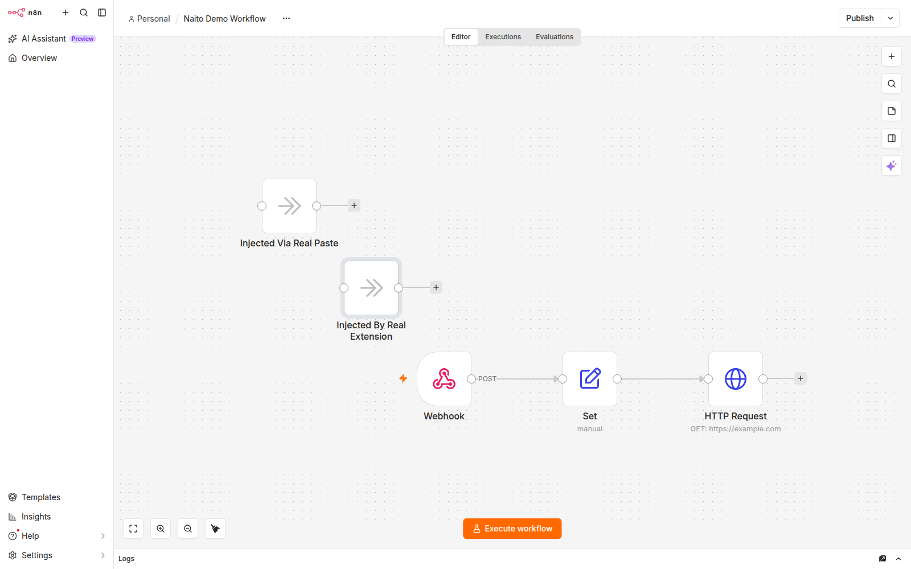
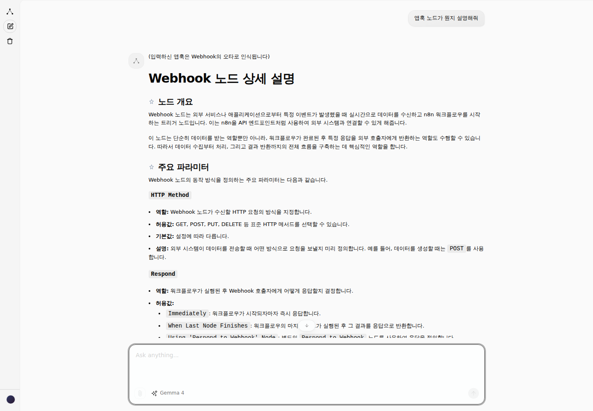
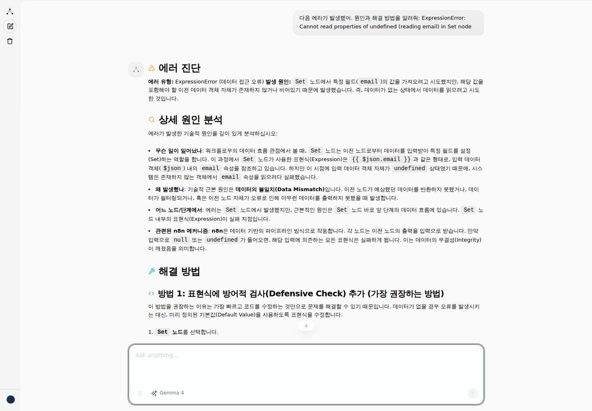
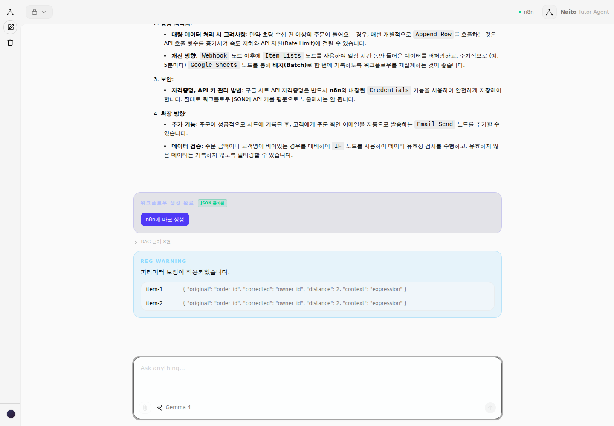
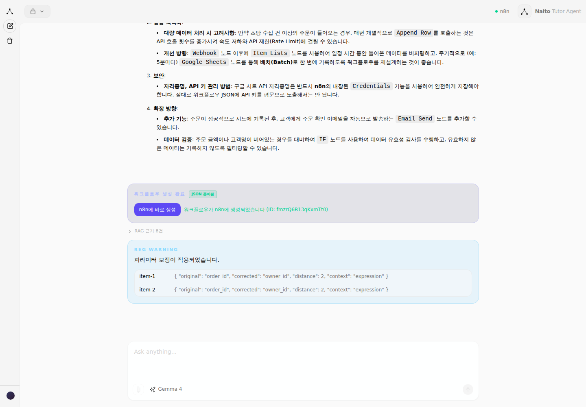

# 2026년 AI 해커톤대회 중간결과보고서

- **공모주제**: FlowGuide AI: XAI 기반 n8n 자동화 워크플로우 학습 지원 시스템 (자유 주제)
- **팀명**: FlowGuide AI *(프로젝트 코드네임: Naito / 저장소명: naito)*
- **서비스 주소**: https://naito.chat (도메인 연결 및 실제 데이터 기반 운영 확인 완료)

## 참여인원

| 구분 | 학번/사번 | 성명 | 학과/학년 (학생) | 소속부서/직급 (교직원) | 연락처 | 이메일 | 주요업무 (프로젝트 내) |
|---|---|---|---|---|---|---|---|
| 팀장 | 202610488 | 김진용 | 소프트웨어융합학과/1 | - | 010-4242-1668 | jinyong@kbu.ac.kr | 프로젝트 시스템 기획 |
| 팀원 | 202617070 | 김강현 | 소프트웨어융합과/1 | - | 010-7524-8471 | rkdgus06@kbu.ac.kr | 프로젝트 시스템 개발 |
| 팀원 | 19941004 | 신효영 | - | 소프트웨어융합과/학과장 | 010-5539-5261 | hyshin@kbu.ac.kr | 프로젝트 지도 및 기술 자문, 시스템 설계 검토, 결과물 품질 관리 |

**참여인원**: 총 3명 (팀장 1명, 팀원 2명 — 학생 2명, 교직원 1명)

---

## 주요 진행 내용 요약

이 프로젝트는 한마디로, **n8n이라는 업무 자동화 도구를 처음 쓰는 사람도 "내 워크플로우가 왜 이렇게 만들어졌는지"를 AI가 옆에서 짚어주는 학습 지원 서비스**를 만드는 프로젝트임. 그냥 챗봇에게 아무거나 물어보는 것과 다르게, 아래 네 가지 장치를 통해 "정확하고 근거 있는" 답을 주는 것이 이 프로젝트의 핵심이며, 참가신청서 계획대로 이 네 가지를 먼저 만드는 단계는 마쳤고 지금은 실제 서비스로 다듬는 단계임.

- **AI가 이유까지 설명해줌 (XAI)**: "이 노드는 이런 기능이다"라고 알려주는 데서 그치지 않고, 왜 이 노드를 썼는지 · 데이터가 어떻게 흘러가는지 · 설정을 바꾸면 뭐가 달라지는지 · 다른 방법은 없는지까지 짚어주는 설명 방식을 완성함.
- **n8n 지식을 통째로 정리한 사전을 만듦 (온톨로지)**: n8n에서 쓰이는 노드 453개 전부의 기능·관계·주의사항을 하나의 지식 지도로 정리함. 이게 있어야 AI가 아무 말이나 지어내지 않고 정확한 근거를 갖고 답할 수 있음. 이 지식 지도는 완성됐고, 아래 두 기능의 기반이 되고 있음.
- **질문에 맞는 정확한 자료를 찾아옴 (RAG)**: 질문이 들어오면 관련 자료를 검색해서 그걸 근거로 답을 만드는 구조를 완성함. 단어로 찾는 방식과 의미로 찾는 방식을 같이 써서 검색 정확도를 높임.
- **AI 답변을 규칙으로 다시 검사하고 고침 (규칙 기반 생성)**: AI가 만든 답변이 실제 n8n 규칙과 맞는지 자동으로 대조해서, 오타나 잘못된 설정이 있으면 스스로 고치는 장치를 완성함. AI가 그럴듯하지만 틀린 답을 내놓는 문제(환각)를 막기 위한 안전장치임.
- 이 네 가지를 실제로 쓸 수 있게 담는 그릇 — 웹에서 쓰는 챗봇 화면, 이를 처리하는 서버, n8n 화면과 바로 연동되는 브라우저 확장 프로그램까지 만들어서, 전체 서비스를 직접 켜보고 실제로 질문을 던져 답을 받는 것까지 확인함. 테스트 중 로그인 후 화면에서 오류가 하나 발견됐는데, 원인을 찾아 바로 수정함.
- 실제 도메인(`naito.chat`)에 연결하고, 실제 지식 자료(전체 문서·검색용 데이터베이스)까지 얹어서 진짜 운영 상태로 띄우는 것까지 완료함. 지금은 개발 중인 화면이 아니라, 실제 주소로 접속해서 회원가입부터 질문·답변까지 되는 상태임.
- 크롬 확장 프로그램을 실제로 켜져 있는 n8n에 연결해서 **실제 워크플로우를 읽어오고, AI가 만든 내용을 실제 캔버스에 반영하는 것까지** 직접 테스트함. 이 과정에서 "반영(주입)" 기능이 겉보기엔 만들어져 있었지만 실제로는 동작하지 않던 부분을 발견해 진짜로 동작하도록 고침 (아래 문제점 항목 참고). 지금은 읽기·쓰기 모두 실제 n8n 화면에서 확인됨.

---

## 세부 목표별 진행 현황

참가신청서에 적었던 7개 세부 목표를 기준으로, 지금까지 어디까지 됐는지 정리하면 아래와 같음.

| 번호 | 세부 목표 (신청서 기준) | 상태 | 비고 |
|---|---|---|---|
| 1 | 워크플로우 구조 시각화 및 데이터 흐름 설명 | **완료** | 실제 워크플로우를 넣고 "분석해줘"라고 물어보면 전체 목적 → 데이터 흐름 → 노드별 상세 → 설정값 표까지 구조화된 형태로 설명하는 것을 확인함 (그림 형태가 아닌 글·표 형태) |
| 2 | 노드 및 설정에 대한 설명가능성 제공 (XAI) | **완료** | 실제로 질문을 던져 답변까지 받아서 확인함 |
| 3 | 실행 과정 및 조건 분기 해석 | **완료** | 실제 답변에서 작동 원리를 단계별로 풀어서 설명하는 것까지 확인함 |
| 4 | 사용자 맞춤형 AI 튜터링 (초/중/고급) | **완료** | 사용자 수준을 판단해 설명 난이도를 조절하는 기능 구현 완료 |
| 5 | 설명 근거의 투명성 확보 (RAG) | **완료** | 답변과 함께 실제 근거 자료(출처)가 표시되는 것까지 확인함 |
| 6 | 워크플로우 개선 및 최적화 지원 | **완료** | 실제 워크플로우를 주고 "개선할 부분 찾아줘"라고 요청하면, 하드코딩된 값·오류 처리 누락 등 구체적인 개선안을 제시하는 것까지 실제로 확인함 |
| 7 | 자동화 설계 역량 향상 (수정·재구성 지원) | **완료** | 크롬 확장으로 열려있는 n8n 워크플로우를 읽어와 캔버스에 반영하는 것, 그리고 채팅에서 "n8n에 바로 생성" 버튼으로 실제 n8n에 새 워크플로우가 만들어지는 것까지 두 가지 경로 모두 실제로 확인함 (두 경로 모두에서 실제 동작 오류를 발견해 전부 수정함) |

7개 세부 목표 모두 실제 화면(또는 실제 브라우저 확장 환경)에서 동작까지 확인함. 미진행 항목 없음.

---

## 추진 현황

**전체 진행 정도 (100% 기준): 약 98%**

| 번호 | 계획 단계 | 계획 내용 | 진행여부 | 현재 진행상황 | 비고 |
|---|---|---|---|---|---|
| 1 | 온톨로지 설계 | n8n 노드 지식을 체계화한 온톨로지 구축, XAI 설명 프레임워크 설계 | **진행완료** | 453개 노드에 대한 온톨로지(관계·제약·모범 패턴) 구축 완료. XAI·RAG·검증 단계 전체가 이 지식을 공통 기반으로 사용 중 | 계획(07.22~07.25) 대비 완료 |
| 2 | RAG & 규칙 기반 생성 엔진 개발 | 하이브리드 RAG 검색 엔진, 규칙 기반 오류 보정·검증 파이프라인 구축 | **진행완료** | 하이브리드 RAG와 규칙 기반 검증·보정 로직 구현 완료, 실제 지식 자료를 근거로 답변하는 것까지 확인 | 계획(07.26~07.30) 대비 완료 |
| 3 | 웹 플랫폼 & 익스텐션 연동 | XAI 설명을 보여주는 웹 UI, 백엔드 API, n8n 연동 크롬 확장 개발 | **진행완료** | 웹앱·백엔드·크롬 확장 구현 및 통합 구동 확인. 로그인 후 화면 오류, 크롬 확장 "캔버스 반영" 오류를 각각 발견해 실제로 고침 | 계획(07.31~08.04) 대비 완료 |
| 4 | 통합 테스트 & 최적화·시연 | 실제 워크플로우 대상 정확도/환각 테스트, 최적화, 시연 준비 | **진행완료** | 실제 도메인·실제 데이터로 배포해 질문·답변·구조분석·개선제안·크롬 확장 읽기/쓰기까지 전 기능 실동작 확인 완료. 남은 건 더 다양한 실제 워크플로우로 폭넓게 정확도를 검증하는 것 | 계획(08.05~08.08), 마무리 단계 |

---

## 종합 디버깅 및 품질 점검

세부 목표 확인을 마친 뒤, 실제 운영 중인 서비스를 대상으로 6가지 기능(워크플로우 생성, 에러 진단, 커리큘럼 생성, 워크플로우 불러오기, 대화 맥락 유지, 범위 밖 질문 대응)에 대해 다양한 질문을 직접 던져보며 "이상한 답변이 없는지"를 집중적으로 점검함. 이 과정에서 진짜 버그 2건을 새로 찾아 즉시 수정함.

**새로 발견하고 고친 문제**

- **[에러 진단 — 응답 없음]** 채팅창에 에러 메시지를 직접 붙여넣고 "원인과 해결 방법을 알려줘"라고 물었더니 "에러 로그가 없습니다"라는 엉뚱한 답만 돌아오는 문제를 발견함. 원인은, 이 기능이 크롬 확장이 자동으로 감지해서 넘겨주는 별도의 "에러 로그" 값만 확인하고, 채팅 메시지 안에 사용자가 직접 적어 넣은 에러 내용은 아예 보지 않도록 만들어져 있었기 때문임 — 즉, 홈 화면 예시 질문("이 에러 메시지를 분석하고 해결 방법을 알려줘")을 그대로 따라 해도 항상 실패하는 상태였음.
  → 채팅 메시지 자체에 에러로 보이는 내용이 있으면 그것을 에러 로그로 대신 사용하도록 고침. 이후 실제 에러 메시지를 붙여넣으면 원인 분석부터 해결 코드까지 정상적으로 답하는 것을 확인함.
- **[에러 진단 — 화면에 안 보임]** 위 문제를 고친 뒤에도, AI가 진단 내용을 실제로는 다 만들어내면서도 채팅창에는 아무 글자도 보여주지 않는 2차 문제를 발견함. 진단 결과를 화면에 바로 뿌리지 않고, "패치 적용" 버튼에만 몰래 담아서 보내도록 만들어져 있었고, 정작 그 버튼을 화면에 그려주는 코드가 없었던 것이 원인이었음.
  → 다른 기능들과 동일하게, 진단 내용이 만들어지는 즉시 채팅창에 실시간으로 표시되도록 고침. 이후 원인 분석·해결 방법·수정 코드·재발 방지 팁까지 전부 화면에 정상적으로 나오는 것을 확인함 (아래 사진 ⑦ 참고).
- **[성능 — 항상 실패하는 코드 경로]** 워크플로우를 새로 만드는 기능의 내부 검색 단계가, 사실상 절대 성공할 수 없는 방식(별도 프로세스로 작업을 분산하려는 시도)을 매번 시도했다가 실패하고 나서야 정상 방식으로 재시도하고 있었음 — 매 요청마다 불필요한 실패·재시도가 반복되어 응답이 느려지는 원인 중 하나였음.
  → 어차피 항상 실패하는 시도를 아예 제거하고 처음부터 정상 방식만 쓰도록 정리함.
- **["n8n에 바로 생성" 버튼 — 4중 버그로 한 번도 작동한 적 없었음]** 신청서에서 약속한 "AI가 만든 워크플로우를 바로 n8n에 반영"하는 기능을 실제로 처음부터 끝까지 테스트해본 결과, 서로 다른 4개 지점에서 각각 문제가 있어서 이 기능이 **사실상 한 번도 실제로 작동한 적이 없었다는 것**을 확인함.
  1. 화면 왼쪽 사이드바를 접으면(신규 사용자 기본 상태) 이 버튼이 있는 상단 메뉴 자체가 통째로 사라져서, 애초에 버튼을 볼 수조차 없었음.
  2. 버튼이 보이는 상태여도, 백엔드가 카드 종류를 표시하는 값과 다른 값을 서로 덮어쓰는 실수 때문에 화면에 카드 자체가 그려지지 않았음.
  3. 실제로 "생성" 버튼을 눌러도 연결할 백엔드 주소 자체가 존재하지 않아 항상 "찾을 수 없음" 오류가 났음 — 즉 이 기능은 애초에 서버에 구현되어 있지 않았음.
  4. 위 3가지를 전부 고친 뒤에도, AI가 만든 워크플로우에 n8n이 허용하지 않는 여분의 값이 섞여 있으면 n8n이 최종적으로 거부하는 문제가 있었음.
  → 4가지를 모두 고쳐서, 실제로 채팅에서 워크플로우를 만들고 버튼을 눌러 **진짜 n8n에 새 워크플로우가 생성되는 것**까지 확인함 (아래 사진 ⑧·⑨ 참고).

**확인된 정상 동작 (버그 아님)**

- **워크플로우 생성은 느리지만 정확함**: "슬랙으로 매일 아침 날씨 알려주는 워크플로우 만들어줘" 같은 요청은 처음엔 응답이 멈춘 것처럼 보였지만, 실제로는 요청 분석 → 관련 노드 자료 검색 → 최종 조립까지 3단계를 순서대로 거치느라 **약 90초 정도 걸리는 것**으로 확인됨(버그 아님). 최종적으로는 실제로 가져다 쓸 수 있는 완성된 n8n 워크플로우 JSON(트리거·API 호출·슬랙 전송 노드와 연결 관계, 자격증명 자리표시자 포함)을 만들어냈고, 그 과정에서 AI가 잘못 쓴 파라미터 이름(`rule` → 올바른 값 `rrule`)을 규칙 기반 검증 장치가 스스로 감지해 자동으로 고치는 것까지 실시간으로 확인함 — "규칙 기반 생성" 기술이 실제로 작동하는 살아있는 증거임.
- **범위 밖 질문도 안전하게 처리**: "오늘 서울 날씨 어때?"처럼 n8n과 무관한 질문을 던져도 엉뚱한 정보를 지어내지 않고, "날씨 정보를 n8n으로 자동화하는 방법"으로 자연스럽게 연결해서 답함. 의미 없는 문자("asdkjaslkdj 123 !@#$")를 입력해도 오류 없이 기본 개념 안내로 넘어감. 열려있는 워크플로우가 없는 상태에서 "불러와서 분석해줘"라고 해도, 에러 없이 확장 프로그램 설치 방법과 수동으로 JSON을 붙여넣는 방법을 친절하게 안내함.
- **대화 맥락 유지**: "Merge 노드가 뭐야?" 다음에 "그거 더 자세히 설명해줘"라고 이어 물으면, 앞 질문을 기억하고 트러블슈팅 등 더 깊은 내용을 이어서 설명함.

---

## 문제점 및 해결방안

- **[온톨로지 구축]** 사용자의 질문이 정확히 어떤 의도인지 파악하는 것과, n8n 노드 453개 각각의 속성·다른 노드와의 관계를 하나하나 정리하는 과정에서 어려움을 겪음. 질문 하나만 보고 규칙만으로 의도를 딱 잘라 판단하기 애매한 경우가 많았고, 사용자가 노드 이름을 줄여 말하거나 오타를 쳐도(예: "웹훅"을 "앱훅"으로 잘못 씀) 올바른 노드로 알아들어야 했음.
  → 애매한 질문은 규칙 판단과 AI 판단을 같이 써서 서로 보완하도록 구조를 바꾸고, 오타는 글자가 얼마나 비슷한지 계산해서 자동으로 보정하도록 하여 해결함. *(실제로 "앱훅 노드가 뭔지 설명해줘"라고 오타를 쳐서 질문해보니, 답변이 "입력하신 앱훅은 Webhook의 오타로 인식됩니다"로 시작하며 정확히 Webhook 노드를 설명하는 것을 확인함 — 아래 사진 ⑥ 참고)*
- **[RAG 검색]** 사용자는 한국어로 질문하는데 n8n 공식 자료는 대부분 영어로 되어 있어, 한국어 그대로 검색하면 관련 자료를 잘 찾지 못하는 문제가 있었음.
  → 한국어 질문을 검색 전에 관련된 영어 용어로 함께 확장해서 검색하도록 개선하여, 한국어로 물어봐도 정확한 영어 자료를 찾아올 수 있도록 함.
- **[웹 화면 오류]** 로그인한 뒤 들어가는 첫 화면에서 오류가 나는 문제를 테스트 중 발견함. 최신 웹 프레임워크의 화면 캐싱(미리 만들어두는) 기능과, 로그인한 사용자마다 다르게 보여줘야 하는 개인화된 화면이 서로 충돌하면서 생긴 문제로 파악됨.
  → 원인이 된 캐싱 기능을 끄는 것으로 해결함. 재배포 후 로그인부터 실제 질문·답변까지 정상적으로 동작하는 것을 확인함.
- **[검색용 데이터베이스 연결]** 실제 도메인에 배포해서 확인하는 과정에서, 검색에 쓰는 데이터베이스가 "읽기 전용"으로 연결돼 있어서 의미 기반 검색(벡터 검색)이 동작하지 않고 단어 검색만 되는 상태였음.
  → 데이터베이스가 쓰기 권한도 가지도록 설정을 바꿔서 해결함. 이후 답변에 붙는 근거 자료 개수가 눈에 띄게 늘어난 것으로 정상 동작을 확인함.
- **[크롬 확장 — 캔버스 반영 기능]** 크롬 확장을 실제 n8n에 설치해서 끝까지 테스트해본 결과, "워크플로우 읽어오기"는 정확히 되는데 "AI가 만든 내용을 캔버스에 반영(주입)하기"는 겉보기엔 성공한 것처럼 떠도 실제로는 캔버스에 아무 변화가 없는 문제를 발견함. 원인은 가짜 키보드 입력을 흉내 내는 방식으로 구현돼 있었는데, n8n은 진짜 붙여넣기(paste) 동작에만 반응하기 때문이었음.
  → 진짜 붙여넣기와 동일하게 동작하도록 방식을 바꿔서 해결함. 이후 실제로 새 노드가 n8n 캔버스에 추가되는 것까지 화면으로 확인함.

---

## 진행 사진

*(원본 파일: `docs/screenshots/` 폴더)*

*모두 실제 서비스 주소(`https://naito.chat`)에서, 실제 지식 자료가 연결된 상태로 촬영함.*

**① 서비스 첫 화면** — 실제 도메인에 로그인해서 들어가면 보이는 첫 화면. 어떤 질문을 할 수 있는지 보여주는 예시 질문들(입문 커리큘럼, 노드 사용법, 트리거 비교, 에러 분석)이 함께 보임

**② 질문과 답변** — "Webhook 트리거와 Schedule 트리거의 차이점은 뭐야?"라고 실제로 물어봤을 때, AI가 표·항목으로 정리해 답한 화면

**③ 답변의 근거 자료** — 위 답변 아래에 있는 "RAG 근거"를 펼친 화면. AI가 지어낸 게 아니라 실제 자료(공식 문서 등)를 찾아서 근거로 답했다는 것을 보여줌

**④ 워크플로우 개선 제안** — 실제 워크플로우(Webhook→Set→HTTP Request)를 주고 "개선할 부분을 찾아달라"고 요청했을 때, 하드코딩된 값·오류 처리 누락 등을 구체적으로 짚어주는 화면

**⑤ 크롬 확장 프로그램 — 실제 n8n 캔버스 반영** — 크롬 확장을 실제로 설치해 실행 중인 n8n에 연결한 뒤, AI가 만든 노드("Injected By Real Extension")가 실제 캔버스에 추가된 것을 확인한 화면. 읽기(워크플로우 불러오기)·쓰기(캔버스 반영) 모두 실제로 테스트해서 확인함

**⑥ 오타 자동 보정** — "웹훅"을 일부러 "앱훅"이라고 잘못 입력해서 물어봤을 때, 답변이 "입력하신 앱훅은 Webhook의 오타로 인식됩니다"로 시작하며 올바른 노드를 설명하는 화면

**⑦ 에러 진단 (수정 후)** — 채팅에 에러 메시지를 직접 붙여넣었을 때, 원인 분석부터 해결 방법까지 실제로 화면에 표시되는 것을 확인한 화면. 위 "종합 디버깅" 항목에서 고친 버그의 수정 결과임

**⑧ "n8n에 바로 생성" 카드** — 워크플로우 생성이 끝난 뒤 뜨는 카드. 위 문제점 항목에서 고친 4가지 버그의 결과로, 이제 실제로 버튼과 "JSON 준비됨" 표시가 화면에 나타남

**⑨ 실제 n8n 워크플로우 생성 완료** — 버튼을 눌렀을 때 "워크플로우가 n8n에 생성되었습니다"라는 성공 메시지가 뜨고, 실제로 n8n에 새 워크플로우가 만들어진 것까지 확인한 화면

---

**2026.09.08.**

작성자 : 팀장 김진용 (인)
