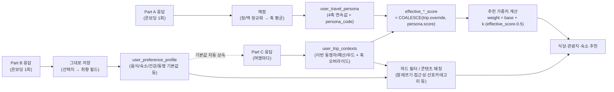

# 전용 여행 성향 진단 시스템 — 개요 (TRAVEL ANIMAL 16)

> 이 문서는 "우리 서비스만의 MBTI"인 **여행 성향 진단 시스템**의 전체 구조를 설명한다. 실제 설문은 **Part A·B·C 세 파일**로 나눠 완성해두었고, 16개 유형별 상세 설명은 [types/](/docs) 폴더의 개별 파일에 있다. 모든 가중치 값과 필드를 한 번에 찾아보려면 [04-reference.md](/docs/reference) 하나만 열면 된다. 이 시스템이 만들어내는 `persona_code`, 4개 축 점수는 [restaurant-recommendation-design.md](/docs/restaurant-recommendation-design)의 `user_travel_persona` 테이블과 6장 추천 알고리즘에 그대로 입력값으로 들어간다.

---

## 1. 이 시스템이 하는 일 — 왜 3개 파트로 나눴는가

사람에 대한 정보는 **바뀌는 빈도가 서로 다르다.** 성격은 거의 바뀌지 않고, 좋아하는 음식이나 숙소 취향은 가끔 바뀌고, "이번 여행에 누구와 가는지"는 여행마다 다르다. 이 빈도 차이를 무시하고 한 설문에 다 몰아넣으면, 매번 여행을 계획할 때마다 이미 안 물어봐도 되는 것까지 또 물어보게 된다. 그래서 세 파트로 나눴다.

| 구분 | 언제 묻는가 | 뽑아내는 것 | 문항 수 | 쓰이는 곳 |
|---|---|---|---|---|
| **[Part A](/docs/questionnaire-a) — 성향 진단** | 온보딩 **1회** (재진단 전까지 불변) | 사교성/취향모험도/가치관/계획성 4개 축 연속 점수 → 16개 유형 | 40문항 (Likert) | `user_travel_persona` |
| **[Part B](/docs/questionnaire-b) — 여행 취향 프로필** | 온보딩 **1회** (설정에서 수시 수정 가능) | 음식·숙소·건강접근성·동행·로지스틱·예산·정보습관 등 상세 고정 취향 | 46문항 (직접 선택, 필수 11개) | `user_preference_profile` |
| **[Part C](/docs/questionnaire-c) — 이번 여행 정보** | **여행을 계획할 때마다** | 이번 동행자/기간/목적지/예산/무드 + 이번 한정 축 오버라이드 | 18문항 (대부분 Part B 기본값 자동 상속) | `user_trip_contexts` |

즉 "재미있는 유형 테스트"처럼 보이지만, 실은 **추천 엔진이 필요로 하는 입력값을 갱신 빈도에 맞춰 세 겹으로 수집하는 온보딩 + 여행 계획 장치**다. Part A·B는 무겁게 한 번, Part C는 가볍게 매번 — 이라는 원칙이 전체 설계를 관통한다.

---

## 2. 왜 4개 축, 16개 유형인가

축을 5개, 6개로 늘리면(32개, 64개 유형) 각 유형을 설득력 있게 설명하기 어려워지고, 문항 수가 늘어나 설문 이탈률이 올라간다. 대신 아래처럼 설계했다.

- **각 축을 "성격 특성"으로 정의**하고, 그 특성이 **성격/여행 스타일/음식 스타일/숙소 스타일 네 가지 맥락에서 각각 어떻게 드러나는지**를 Part A 문항으로 물었다. 즉 축은 4개뿐이지만, 문항은 4개 생활 영역에 걸쳐 골고루 배치되어 있어 "여행 스타일, 음식 스타일, 숙소 스타일, 성격을 다 뽑아낸다"는 목표를 충족한다.
- **더 세밀한 개인 취향**(구체적으로 어떤 음식을 좋아하는지, 어떤 숙소 편의시설이 필요한지, 알레르기가 있는지)은 유형을 늘리는 대신 **Part B**로 따로, 훨씬 깊게 뽑는다. 이렇게 하면 유형 체계는 "이 사람은 대략 어떤 여행자인가"라는 큰 그림에 집중하고, 미세한 취향은 프로필 데이터로 정확하게 반영할 수 있다.
- **트립마다 달라지는 것**(동행자, 예산, 이번 여행의 목적, "이번엔 평소와 다르게 놀고 싶다")은 유형에 담을 수 없는 정보이므로 아예 별도 파트(Part C)로 분리하고, 축 오버라이드 메커니즘(6절, Part C 5절)으로 유형 체계의 한계를 보완한다.
- 16개는 사람이 외우고 공유하기 좋은 임계치이기도 하다 (실제 MBTI가 16개로 자리 잡은 것도 같은 이유). 나중에 데이터가 쌓여 "축을 하나 더 쪼개야겠다"는 근거가 생기면 `survey_version`을 올려 개정하면 된다 (8절 참고).

---

## 3. 4개 축 정의

| 축 | 내부 필드명 | 0 쪽 | 1 쪽 | 코드 문자 | 주로 드러나는 문항 맥락 |
|---|---|---|---|---|---|
| **사교성** | `social_score` | Private(프라이빗) | Social(소셜) | `P` / `S` | 성격, 숙소 스타일 |
| **취향모험도** | `adventure_score` | Classic(클래식) | Adventure(어드벤처) | `C` / `A` | 여행 스타일, 음식 스타일 |
| **가치관** | `experience_score` | Value(가성비) | Experience(경험) | `V` / `E` | 음식 스타일, 숙소 스타일 |
| **계획성** | `flow_score` | Plan(플랜) | Flow(플로우) | `J` / `F` | 성격, 여행 스타일 |

- 축 점수는 0~1 사이 **연속값**으로 저장한다 (`user_travel_persona.social_score` 등). 0.5를 기준으로 이분화한 문자만 유형 코드로 화면에 노출하고, **추천 가중치 계산에는 반드시 연속값을 쓴다** ([restaurant-recommendation-design.md](/docs/restaurant-recommendation-design) 4.3절과 동일 원칙).
- **코드 순서는 항상 사교성·모험도·가치관·계획성** 순으로 고정한다. 예: `SAEF` = Social + Adventure + Experience + Flow.

---

## 4. 16개 유형 전체 그리드

| 코드 | 유형명 | 한 줄 태그 | 상세 |
|---|---|---|---|
| SAEF | 페스티벌 수달 | 흥 따라, 사람 따라, 순간 따라 | [보기](/docs/type-saef) |
| SAEJ | 갈라 플라밍고 | 완벽하게 세팅된 특별한 순간을, 함께 | [보기](/docs/type-saej) |
| SAVF | 백패커 원숭이 | 친구 따라 발길 닿는 대로, 실속있게 | [보기](/docs/type-savf) |
| SAVJ | 플래너 꿀벌 | 무리와 함께, 알뜰하고 야무지게 | [보기](/docs/type-savj) |
| SCEF | VIP 사자 | 익숙한 사람들과 여유롭게, 근사하게 | [보기](/docs/type-scef) |
| SCEJ | 볼룸 백조 | 격식 있게 준비된, 근사한 모임 | [보기](/docs/type-scej) |
| SCVF | 동네 참새 | 아는 사람들과 부담 없이, 즉흥적으로 | [보기](/docs/type-scvf) |
| SCVJ | 패밀리 펭귄 | 다 같이, 알뜰하게, 꼼꼼하게 | [보기](/docs/type-scvj) |
| PAEF | 노마드 여우 | 혼자, 자유롭게, 특별하게 | [보기](/docs/type-paef) |
| PAEJ | 탐험가 매 | 혼자, 치밀하게, 깊이 있게 | [보기](/docs/type-paej) |
| PAVF | 로드 낙타 | 혼자, 정처없이, 실속 있게 | [보기](/docs/type-pavf) |
| PAVJ | 딜헌터 다람쥐 | 혼자, 알뜰살뜰, 치밀하게 | [보기](/docs/type-pavj) |
| PCEF | 힐링 판다 | 나만 아는 곳에서, 여유롭게 | [보기](/docs/type-pcef) |
| PCEJ | 료칸 거북이 | 혼자, 완벽하게 준비된 프리미엄 휴식 | [보기](/docs/type-pcej) |
| PCVF | 호캉스 코알라 | 혼자, 부담 없이, 늘어져서 | [보기](/docs/type-pcvf) |
| PCVJ | 체크리스트 비버 | 혼자, 완벽 계획, 검증된 곳만 | [보기](/docs/type-pcvj) |

### 한눈에 보기 (사교성 × 계획성 2×2, 각 칸은 모험도·가치관으로 다시 4갈래)

| | **Plan(계획적)** | **Flow(즉흥적)** |
|---|---|---|
| **Social(함께)** | 갈라 플라밍고 `SAEJ` · 플래너 꿀벌 `SAVJ` · 볼룸 백조 `SCEJ` · 패밀리 펭귄 `SCVJ` | 페스티벌 수달 `SAEF` · 백패커 원숭이 `SAVF` · VIP 사자 `SCEF` · 동네 참새 `SCVF` |
| **Private(혼자)** | 탐험가 매 `PAEJ` · 딜헌터 다람쥐 `PAVJ` · 료칸 거북이 `PCEJ` · 체크리스트 비버 `PCVJ` | 노마드 여우 `PAEF` · 로드 낙타 `PAVF` · 힐링 판다 `PCEF` · 호캉스 코알라 `PCVF` |

같은 칸 안에서는 **모험도(Adventure/Classic)** 와 **가치관(Experience/Value)** 조합으로 다시 나뉜다 — 자세한 조합은 4절 표 참고.

---

## 5. 유형 간 관계 (궁합) 읽는 법

각 유형 파일의 "궁합" 절은 아래 규칙으로 계산했다.

- **찰떡 케미**: 4개 축 중 정확히 1개만 다른 유형 (가장 가깝고 편안한 조합, 유형당 4개 존재).
- **정반대 유형**: 4개 축이 모두 반대인 유형 (유형당 1개뿐). 부딪힐 것 같지만 서로 부족한 부분을 채워주는 조합으로 서술했다.
- **조율이 필요한 조합**: 2~3개 축이 달라 여행 로지스틱(동선·예산·템포)에서 사전 조율이 필요한 조합.

8쌍의 정반대 유형: `SAEF↔PCVJ`, `SAEJ↔PCVF`, `SAVF↔PCEJ`, `SAVJ↔PCEF`, `SCEF↔PAVJ`, `SCEJ↔PAVF`, `SCVF↔PAEJ`, `SCVJ↔PAEF`.

---

## 6. Part B·C 미리보기 — 여행 취향 프로필과 이번 여행 정보

Part A(축·유형)는 3~5절에서 이미 자세히 다뤘다. 이 절은 **Part B와 Part C가 각각 무엇을 담고 있는지**, 그리고 Part C의 핵심 신규 기능인 **축 오버라이드**가 실제로 어떻게 동작하는지 요약한다. 문항 전체 목록은 각 파트 파일에, 필드/값 전체는 [04-reference.md](/docs/reference)에 있다.

### 6.1 Part B 미리보기 (46문항, 온보딩 1회)

| 섹션 | 문항 수 | 필수 | 대표 문항 |
|---|---|---|---|
| B-1 음식 프로필 | 14 | 4 | "식품 알레르기가 있나요?" |
| B-2 숙소 프로필 | 10 | 4 | "숙소에 꼭 있어야 하는 시설은?" |
| B-3 신체·접근성·건강 | 6 | 1 | "이동 시 보조기구를 사용하나요?" |
| B-4 동행 기본 성향 | 4 | 1 | "평소 가장 자주 함께 여행하는 대상은?" |
| B-5 이동·로지스틱 기본 성향 | 5 | 0 | "장거리 이동 시 직항을 선호하나요?" |
| B-6 예산·소비 기본 성향 | 3 | 1 | "가장 아끼지 않는 지출 항목은?" |
| B-7 정보 습득 & 기록 습관 | 4 | 0 | "여행지·맛집 정보를 주로 어디서 얻나요?" |

→ 문항 전체와 저장 필드 매핑은 [02-questionnaire-b-profile.md](/docs/questionnaire-b), 필드 딕셔너리는 [04-reference.md](/docs/reference) 4절.

### 6.2 Part C 미리보기 (18문항, 여행마다)

| 섹션 | 문항 수 | 대표 문항 | Part B 기본값 상속 |
|---|---|---|---|
| C-1 이번 여행 기본 정보 | 6 | "이번 여행, 누구와 함께 하나요?" | `default_companion_type` |
| C-2 이번 여행 예산 | 3 | "이번 여행 한 끼 식사 예산은?" | `default_meal_budget_tier` 등 |
| C-3 이번 여행 목적·무드 | 3 | "이번 여행의 주된 목적은?" | 없음(매번 신규) |
| C-4 이번 여행 컨디션 | 2 | "이번 여행에 특별히 신경 써야 할 점이 있나요?" | 없음(매번 신규) |
| C-5 축 오버라이드 | 4 | "이번 여행, 평소와 다르게 즐기고 싶은 정도는?" | 평소 `persona` 축 점수 |

→ 문항 전체와 저장 필드 매핑은 [03-questionnaire-c-trip.md](/docs/questionnaire-c), 필드 딕셔너리는 [04-reference.md](/docs/reference) 5절.

### 6.3 축 오버라이드 — 유형은 고정, 여행은 유동적

Part A가 만든 16개 유형은 "평소의 나"다. 하지만 실제 여행은 늘 평소 모습대로 흘러가지 않는다. 그래서 Part C 마지막에 4개 축마다 슬라이더 하나씩(총 4문항)을 두고, **이번 여행 한정으로만** 축 점수를 바꿀 수 있게 했다.

- 슬라이더의 기본 위치는 사용자의 평소 `persona` 축 점수다. 건드리지 않으면 `NULL`로 저장되고, 알고리즘은 평소 값을 그대로 쓴다.
- 슬라이더를 움직이면 그 값이 `user_trip_contexts`에 `*_score_override`로 저장되고, **이 여행의 추천 계산에서만** 평소 값을 대체한다. `user_travel_persona`(평소 유형) 자체는 전혀 바뀌지 않는다.

```
effective_social_score = COALESCE(trip.social_score_override, persona.social_score)
# adventure/experience/flow도 동일한 방식
```

**예시**: 패밀리 펭귄(`SCVJ`, 평소 `social_score` 0.25)인 사용자가 오랜만에 대학 동기들과 여행을 떠나며 "이번엔 평소보다 사람들과 어울리고 싶다"고 사교성 슬라이더를 0.9까지 옮겼다고 하자. 이번 여행에서만 `effective_social_score = 0.9`가 적용되어, 식당 추천이 마치 페스티벌 수달(`SAEF`)에 가까운 가중치(인기도·SNS 화제성 가중↑)로 계산된다. 평소 프로필과 유형(`SCVJ`)은 그대로이고, 이번 여행 레코드에만 이 변화가 남는다.

관련 DB 컬럼(`user_trip_contexts.social_score_override` 등)과 공식은 [restaurant-recommendation-design.md](/docs/restaurant-recommendation-design) 3.4절, 계산된 16유형 전체 가중치 값은 [04-reference.md](/docs/reference) 1절에 정의되어 있다.

---

## 7. 데이터 흐름 요약



각 유형 파일의 "추천 알고리즘 가중치 프로파일" 표는 이 축 점수를 [restaurant-recommendation-design.md](/docs/restaurant-recommendation-design) 4.4절/6.4절의 공식(`weight = base + k × (axis_score - 0.5)`)에 대입해 계산한 **예시값**이다 (실제 사용자는 유형 안에서도 축 점수가 조금씩 다르고, Part C에서 오버라이드하면 그 여행에 한해 값이 또 달라지므로 연속값을 그대로 쓴다 — 유형 파일의 수치는 "이 유형의 평소 경향"을 보여주기 위한 참고용). 16개 유형 전체를 한 표로 모은 버전은 [04-reference.md](/docs/reference) 1절.

---

## 8. 설문 개정 관리

문항을 나중에 고치거나 추가/삭제할 경우 `user_travel_persona.survey_version`을 올린다. 과거 응답자의 유형을 재계산하지 않고 그대로 두되, 신규/재진단 사용자부터 새 버전 문항이 적용되도록 API 레벨에서 버전을 분기한다. Part A·B·C 세 파일 모두 개정 시 버전 번호를 헤더에 명시한다 (현재 `v2.0`). Part A/B/C는 서로 다른 빈도로 개정될 수 있으므로 버전 번호도 파일별로 독립적으로 관리한다 — 예를 들어 Part C(매 여행)에 문항 하나를 추가한다고 Part A(성향 진단)의 과거 채점 결과가 영향을 받아서는 안 된다.

가중치 공식(2절)이나 `user_preference_profile`/`user_trip_contexts` 필드가 바뀌면 [04-reference.md](/docs/reference)도 함께 갱신해야 한다 — 현재는 수동 동기화이니, 문서를 고칠 때는 항상 "이 변경이 04-reference.md에도 반영돼야 하는가"를 체크리스트로 확인한다.
