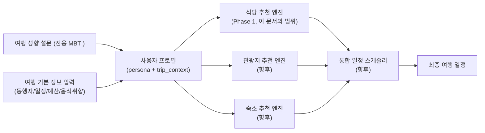
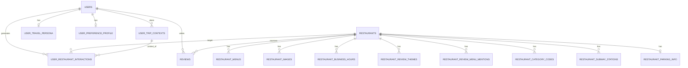
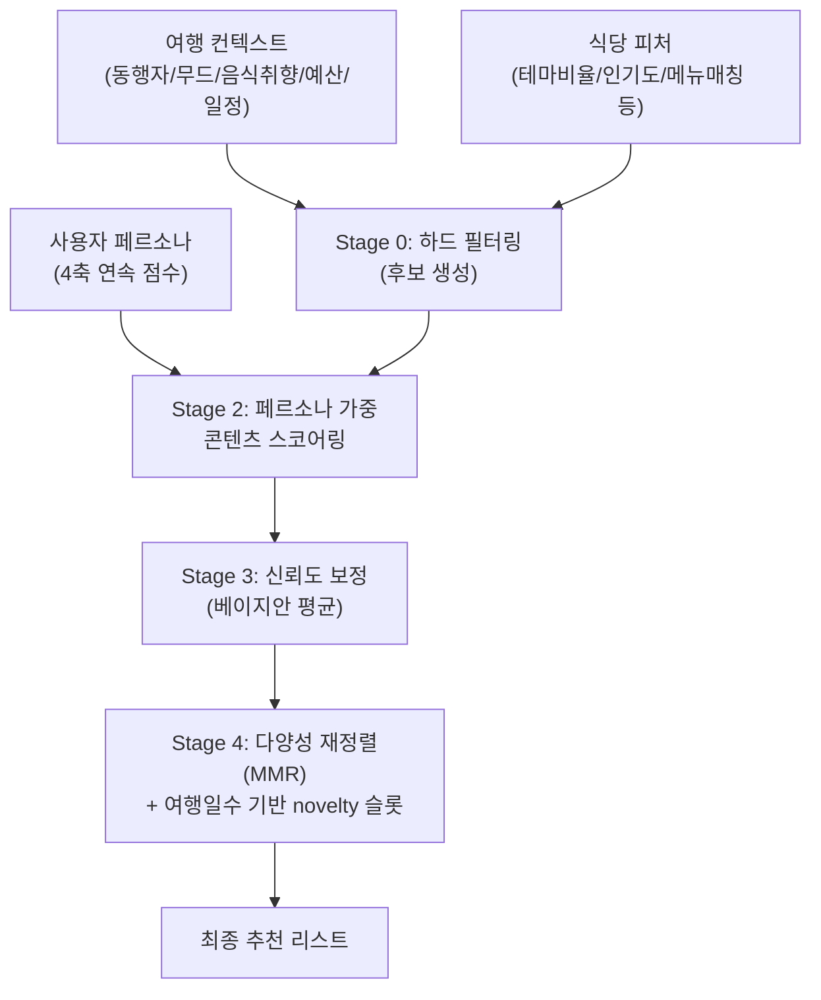

# 식당 추천 시스템 설계 문서 (Phase 1 — 식당 추천 알고리즘)

> 최종 목표: MBTI형 여행 성향 설문 + 여행 기본 정보(동행자/무드/음식취향/일정 등)를 입력받아 **식당·관광지·숙소를 통합 추천**하는 시스템.
> 이 문서는 그 1단계인 **식당 추천**의 DB 설계와 알고리즘 설계를 다룬다. 단, 이후 관광지/숙소 모듈이 매끄럽게 붙을 수 있도록 사용자 프로필·여행 컨텍스트·스코어링 파이프라인 구조는 도메인 공통으로 설계한다.

---

## TL;DR

- `restaurant.json`을 직접 열어 구조를 분석했다 (실제 50개 업체, 서울 강남구/서초구 강남역 상권 샘플, 네이버 플레이스 크롤링 데이터로 추정). 아래 설계는 이 실제 구조를 기준으로 한다.
- **리뷰 원문(댓글·개별 평점)은 JSON에 없고, 대신 네이버가 집계한 "리뷰 테마 키워드 카운트"와 "리뷰에서 언급된 메뉴 카운트"가 있다.** 이걸 콘텐츠 기반 추천의 핵심 신호로 쓴다.
- **별점(`visitorReviewsScore`, `reviewStats.avgRating`)은 50개 중 27개가 0이다.** 네이버가 5점 별점 제도를 폐지했기 때문으로 추정되며, 신뢰할 수 있는 핵심 지표로 쓸 수 없다.
- DB는 **PostgreSQL + PostGIS(+pgvector)** 를 추천한다. 관계형 무결성(조인/집계)과 지리 검색(반경 검색)이 둘 다 핵심이라 단일 엔진으로 커버하는 게 실용적이다.
- 추천 알고리즘은 리뷰-평점 데이터가 없는 현재 상황에 맞춰 **협업 필터링이 아니라 "콘텐츠 기반 + 페르소나 가중 + 인기도 보정" 하이브리드**로 시작하고, 앱이 자체 리뷰/행동 데이터를 모으면 Phase 2~3에서 협업 필터링을 얹는 로드맵을 제시한다.
- 여행 성향은 4개 축(사교성/취향모험도/가치관/계획성)의 **연속 점수**로 저장하고, 화면 노출용으로만 16개 타입 코드로 이분화한다 (내부 로직은 연속값 사용 — 정보 손실 방지).
- `restaurant.json` 파일 자체에 **터미널 이스케이프 시퀀스가 섞여 들어가 있어 현재 유효한 JSON이 아니다** (128번째 줄 부근). ETL 전에 반드시 정제 필요. → [10장](#10-open-questions-구현-전-확인-필요-사항) 참고.

---

## 목차

1. [원본 데이터(restaurant.json) 분석](#1-원본-데이터restaurantjson-분석)
2. [전체 시스템 아키텍처 개요](#2-전체-시스템-아키텍처-개요)
3. [DB 스키마 설계](#3-db-스키마-설계)
4. [여행 성향 설문(전용 MBTI) 설계](#4-여행-성향-설문전용-mbti-설계)
5. [여행 컨텍스트 입력 설계](#5-여행-컨텍스트-입력-설계)
6. [식당 추천 알고리즘 설계](#6-식당-추천-알고리즘-설계)
7. [콜드스타트 대응 및 협업 필터링 로드맵](#7-콜드스타트-대응-및-협업-필터링-로드맵)
8. [평가 및 검증 방법](#8-평가-및-검증-방법)
9. [확장 로드맵 (관광지·숙소 통합)](#9-확장-로드맵-관광지숙소-통합)
10. [Open Questions (구현 전 확인 필요 사항)](#10-open-questions-구현-전-확인-필요-사항)

---

## 1. 원본 데이터(restaurant.json) 분석

### 1.1 데이터 개요 및 추정 출처

실제 파일을 파싱해서 확인한 결과:

- **50개 업체**, 주소 기준 서울 강남구 31곳 / 서초구 19곳 (강남역 상권 샘플로 추정)
- 이미지 URL이 전부 `ldb-phinf.pstatic.net` 도메인이고, `parkingInfo` 내부에 `__typename: "InformationParking"` 같은 GraphQL 타입명이 그대로 남아있는 것으로 볼 때 **네이버 플레이스(Naver Place) 데이터를 크롤링/수집**한 것으로 추정된다.
- `place_id`는 50개 모두 고유하다 (중복 없음).
- 카테고리는 22종으로 다양하다 (육류·고기요리 7곳, 한식 5곳, 요리주점 5곳, 중식당 4곳, 곱창·막창·양 4곳, 양식 4곳 등 롱테일 분포).

**가장 중요한 특징**: 이 JSON에는 "누가 몇 점을 줬고 어떤 댓글을 남겼는지"에 대한 원시 리뷰 데이터가 전혀 없다. 그 대신 네이버가 이미 한 번 집계해놓은 **2차 가공 통계**가 들어있다.

| 있는 것 | 없는 것 |
|---|---|
| 리뷰 총 개수 (`visitorReviewsTotal`, `blogReviewTotal`) | 개별 리뷰 텍스트/댓글 |
| 리뷰 테마별 언급 횟수 (`reviewThemes`: 맛/분위기/서비스 등) | 개별 사용자 평점 |
| 리뷰에서 언급된 메뉴명 빈도 (`reviewMenus`) | 작성자 정보, 작성 시각 |
| 리뷰 이미지 개수 (`reviewStats.imageReviewCount`) | 우리 서비스 자체 사용자의 리뷰/평점 (애초에 아직 없음) |

즉, "리뷰 정보가 없다"는 게 완전히 빈 상태가 아니라 **"원문은 없지만 집계 신호는 있는"** 상태다. 이 집계 신호(테마 비율, 인기 메뉴)를 콘텐츠 기반 추천의 핵심 피처로 쓰고, 우리 서비스만의 리뷰/평점은 별도 테이블을 만들어 서비스 오픈 이후 자체적으로 쌓아야 한다 (7장 참고).

### 1.2 필드별 상세 레퍼런스

실제 데이터를 기준으로 각 필드의 타입과 특이사항을 정리한다.

| 필드 | 타입 | 설명 및 실측 특이사항 |
|---|---|---|
| `place_id` | string | 네이버 업체 고유 ID. 50/50 유일값 확인. DB의 자연키(natural key)로 사용 |
| `name` | string | 업체명 |
| `category` | string | 사람이 읽는 카테고리명 (예: "중식당"). 22종 관측 |
| `categoryCode` | string | 최하위 카테고리 코드 (예: "220861") |
| `categoryCodeList` | string[] | 대분류→소분류 계층 코드 배열. 길이가 업체마다 3~10으로 다름 (계층 깊이가 다름) |
| `address` / `roadAddress` | string | 지번주소 / 도로명주소 |
| `phone` / `virtualPhone` | string\|null | `phone`은 원 번호(대부분 null), `virtualPhone`은 네이버 안심번호(050으로 시작, 항상 존재) |
| `conveniences` | string[] | 편의시설 태그. 관측된 전체 집합 13종: 간편결제, 남/녀 화장실 구분, 노키즈존, 단체 이용 가능, 대기공간, 무선 인터넷, 반려동물 동반, 발렛파킹, 배달, 예약, 유아의자, 주차, 포장 |
| `facilities` | string[] | `conveniences`와 겹치지만 **휠체어 이용, 장애인 주차구역, 콜키지 가능 여부** 등 접근성/부가정보가 더 있는 확장 집합. **둘을 병합하지 말고 따로 저장** 권장 |
| `visitorReviewsTotal` | int | 방문자 리뷰 총 수. 실측 184~33,371 (평균 4,729) — 편차가 매우 커서 로그 스케일 정규화 필수 |
| `visitorReviewsScore` | int | **50개 중 23개만 0이 아님.** 네이버가 별점 제도를 폐지(2021년경)한 흔적으로 추정. 핵심 신호로 신뢰 불가 |
| `x`, `y` | string | 좌표. 네이버 컨벤션상 `x`=경도(lon), `y`=위도(lat) — **PostGIS의 `ST_MakePoint(x, y)`도 (lon, lat) 순서**라 그대로 매핑하면 된다 (흔한 위경도 순서 실수를 피할 수 있는 지점) |
| `description` | string | 장문 텍스트. 실제로 읽어보면 지역+업종 키워드를 반복 배치한 **SEO/마케팅용 문구**에 가깝다 ("강남역 중국집", "강남역 코스요리 회식" 같은 패턴 반복). 객관적 사실 신호가 아니라 홍보 문구이므로 감성분석/신뢰 신호로 쓰지 말고, 키워드 추출 정도의 보조 텍스트로만 활용 |
| `homepage`, `siteLanding`, `homepageEtc` | string\|array | 홈페이지 URL. `siteLanding`은 50개 중 37개만 존재 |
| `businessHours` | object[] | 보통 1개 원소. `status`(영업중/브레이크타임/24시간 영업/영업 전 — **수집 시점 스냅샷이라 실시간 아님**), `schedule[]`(요일별 start/end/breakHours/lastOrderTimes) |
| `parkingInfo` | object\|null | 50개 중 48개 존재. `description`, `basicParking{isFree,...}`, `valetParking{isFree,...}` |
| `reviewStats` | object | `{avgRating, totalCount, imageReviewCount, authorCount}`. `avgRating`은 위 `visitorReviewsScore`와 동일하게 대부분 0 |
| `reviewThemes` | {code,label,count}[] | **핵심 신호.** 네이버가 사전 정의한 리뷰 키워드(예: `taste`="맛", `mood`="분위기", `service`="서비스", `price`="가격", `amount`="음식량", `waitingtime`="대기시간", `cleanliness`="청결도", `purpose`="목적", `parking`="주차")별로 리뷰 작성자가 체크한 횟수. 대체로 긍정형 문구에 대한 체크 횟수로 알려져 있으나 일부(대기시간/주차)는 중립 정보일 수 있음 — [10장](#10-open-questions-구현-전-확인-필요-사항) 확인 필요 |
| `reviewMenus` | {label,count}[] | **핵심 신호.** 리뷰 텍스트 마이닝으로 추출된 메뉴명 언급 빈도. "실제로 사람들이 먹고 언급한 메뉴"라 사용자 음식 취향과의 콘텐츠 매칭에 매우 유용 |
| `blogReviewTotal` | int | 블로그 리뷰 수. 실측 23~9,364 (평균 1,959) |
| `subwayStations` | {name,typeDesc}[] | 인근 지하철역. `name`은 출구번호, `typeDesc`는 "역명 호선" |
| `images` | string[] | 대표 이미지 URL 목록 |
| `menus` | object[] | 업체당 1~152개 (평균 26.4개). `price`가 **항상 숫자 문자열은 아님** — `""`(가격 미표기, "시가"류 추정), `"9000~14000"`(범위) 형태 존재. 파싱 로직 필수 |
| `menuImages` | string[] | 메뉴판 이미지 |

### 1.3 데이터 품질 이슈 및 주의사항

실제 데이터를 뜯어보면서 확인한, 설계에 바로 영향을 주는 이슈들이다.

1. **별점이 사실상 죽은 필드다.** `visitorReviewsScore`/`reviewStats.avgRating` 둘 다 50개 중 27개가 0이다. 별점 기반 추천/정렬을 절대 1순위 로직으로 두면 안 되고, `reviewThemes`(테마 비율)와 `visitorReviewsTotal`(리뷰량) 조합으로 "평점"의 대체 신호를 만들어야 한다 (6.3절).
2. **`description`은 마케팅 문구다.** 객관적 사실 설명이 아니라 SEO 목적의 반복적 홍보 텍스트로 보인다. 별도 검증 없이 감성분석 등에 쓰면 왜곡된 신호가 나올 수 있다.
3. **`menus[].price`는 항상 숫자가 아니다.** 범위 문자열(`"9000~14000"`)과 빈 문자열이 섞여 있어, 최소/최대를 분리 파싱하고 빈 값은 NULL 처리하는 전처리가 필요하다.
4. **`categoryCodeList` 길이가 업체마다 다르다** (3~10). 계층 구조를 유지하려면 `position`(순서) 컬럼이 있는 별도 테이블로 정규화해야 한다.
5. **`conveniences`와 `facilities`는 부분적으로만 겹친다.** `facilities`에만 있는 접근성 정보(휠체어, 장애인 주차구역)가 있으므로 병합하지 말고 둘 다 보존한다.
6. **`parkingInfo`가 없는 업체가 있다** (48/50). 관련 테이블/컬럼은 반드시 nullable.
7. **원본 파일 자체가 깨져 있다.** `restaurant.json`을 그대로 파싱해보면 128번째 줄 부근에서 에러가 난다. 실제로 열어보니 텍스트 중간에 터미널 이스케이프 시퀀스(`\x1b[ ... 118;1:3u ...`)가 섞여 들어가 있다 — 아마 파일을 만들거나 편집하는 과정에서 터미널 키 입력 시퀀스가 잘못 캡처되어 끼어든 것으로 보인다. **지금 상태로는 `JSON.parse`/`json.load`가 실패한다.** ETL 스크립트를 짜기 전에 이 한 바이트 시퀀스부터 제거해야 한다. (원하시면 지금 바로 고쳐드릴 수 있습니다.)

---

## 2. 전체 시스템 아키텍처 개요

식당 추천은 전체 시스템의 1단계지만, 아래처럼 **"사용자 프로필(페르소나+여행 컨텍스트)"을 도메인 공통 자산으로 분리**해두면 관광지/숙소 모듈이 나중에 그대로 재사용할 수 있다.



설계 원칙 3가지:

1. **페르소나·취향 프로필·여행 컨텍스트 테이블은 도메인 공통.** `user_travel_persona`(성향, Part A), `user_preference_profile`(상세 취향, Part B), `user_trip_contexts`(이번 여행, Part C)는 식당뿐 아니라 관광지·숙소 추천 엔진도 그대로 참조한다.
2. **스코어링 파이프라인 구조를 도메인 간에 통일.** "하드 필터 → 피처 엔지니어링 → 페르소나 가중 → 신뢰도 보정 → 다양성 재정렬"이라는 5단계 구조(6장)를 관광지/숙소도 동일하게 따르되, 피처만 도메인별로 바뀐다.
3. **위치 컬럼을 표준화(GEOGRAPHY).** 나중에 "오늘 방문한 관광지 근처 식당", "숙소 기준 반경 내 맛집" 같은 도메인 간 결합 쿼리가 바로 가능해진다.

---

## 3. DB 스키마 설계

### 3.1 설계 원칙

- **PostgreSQL + PostGIS + pgvector 하나로 통일**을 권장한다. 이유:
  - 페르소나/트립/리뷰 간의 조인·집계(카테고리별 평균, 베이지안 보정 등)가 추천 로직의 핵심인데, 이건 관계형 DB가 압도적으로 편하다.
  - 위치 기반 반경 검색(관광지/숙소 통합 시 필수)은 PostGIS가 사실상 표준이다.
  - 콘텐츠 임베딩 기반 의미 매칭(6.3절 `menu_match` v2)이 필요해지면 `pgvector` 확장으로 벡터도 같은 DB에 넣을 수 있어, 별도 벡터 DB(Pinecone 등)를 초기부터 들일 필요가 없다.
  - MongoDB류 문서형 DB도 고려할 수 있지만, 집계/조인이 많은 추천 워크로드 특성상 지금 단계에서 두 개 DB를 운영할 이유가 없다.
- **소스에 종속되지 않는 서라게이트 키를 쓴다.** `place_id`는 네이버 값이므로 내부 PK로 직접 쓰지 않고 `restaurants.id`(내부 발급) + `(source, source_id)` 유니크 조합으로 보관한다. 나중에 카카오맵/구글 플레이스/공공데이터 등 다른 소스가 추가되거나, 관광지·숙소도 여러 소스를 합칠 걸 감안하면 이 구조가 안전하다.
- **원본 JSON은 통째로 보존한다.** `raw_payload JSONB` 컬럼에 원문을 그대로 넣어둔다. 정규화 과정에서 실수로 정보가 누락되어도 재처리(reprocessing)가 가능하고, 소스 스키마가 바뀌었을 때 감사(audit)하기도 쉽다.
- **정규화 vs JSONB 절충 기준**: 필터링·조인·집계에 실제로 쓰이는 필드(카테고리, 좌표, 편의시설, 테마 카운트 등)는 정규화된 컬럼/테이블로 뽑아내고, 자주 조회만 되고 구조가 가변적인 중첩 데이터(브레이크타임, 라스트오더, 메뉴 이미지 등)는 JSONB로 그대로 둔다.

### 3.2 ERD



### 3.3 테이블 DDL — 식당 도메인 (restaurant.json에서 채움)

```sql
CREATE EXTENSION IF NOT EXISTS postgis;
CREATE EXTENSION IF NOT EXISTS vector; -- pgvector: 6.3절 menu_match v2(임베딩 유사도)용

-- 1) 식당 코어 테이블
CREATE TABLE restaurants (
    id                     BIGSERIAL PRIMARY KEY,
    source                 TEXT NOT NULL DEFAULT 'naver_place',  -- 향후 kakao_map, google_places 등 추가 대비
    source_id              TEXT NOT NULL,                        -- 원본 place_id
    name                   TEXT NOT NULL,
    category               TEXT,
    category_code          TEXT,
    address                TEXT,
    road_address           TEXT,
    phone                  TEXT,
    virtual_phone          TEXT,
    description            TEXT,                                 -- 마케팅성 텍스트, 신뢰 신호로 사용 금지
    homepage               TEXT,
    site_landing           TEXT,
    location               GEOGRAPHY(POINT, 4326),                -- ST_MakePoint(x, y) — 그대로 (lon, lat)
    visitor_reviews_total  INTEGER NOT NULL DEFAULT 0,
    visitor_reviews_score  NUMERIC(3,2) NOT NULL DEFAULT 0,       -- 대부분 0, legacy 취급 (1.3절)
    blog_review_total      INTEGER NOT NULL DEFAULT 0,
    review_avg_rating      NUMERIC(3,2) NOT NULL DEFAULT 0,       -- 위와 동일 주의
    review_total_count     INTEGER NOT NULL DEFAULT 0,
    review_image_count     INTEGER NOT NULL DEFAULT 0,
    review_author_count    INTEGER NOT NULL DEFAULT 0,
    conveniences           TEXT[] NOT NULL DEFAULT '{}',
    facilities             TEXT[] NOT NULL DEFAULT '{}',          -- conveniences와 별도 보존 (1.3절)
    keywords                TEXT[] NOT NULL DEFAULT '{}',          -- keywordList
    raw_payload            JSONB NOT NULL,                        -- 원본 JSON 그대로 보존
    created_at             TIMESTAMPTZ NOT NULL DEFAULT now(),
    updated_at             TIMESTAMPTZ NOT NULL DEFAULT now(),
    UNIQUE (source, source_id)
);

CREATE INDEX idx_restaurants_location     ON restaurants USING GIST (location);
CREATE INDEX idx_restaurants_category     ON restaurants (category);
CREATE INDEX idx_restaurants_conveniences ON restaurants USING GIN (conveniences);
CREATE INDEX idx_restaurants_facilities   ON restaurants USING GIN (facilities);
CREATE INDEX idx_restaurants_keywords     ON restaurants USING GIN (keywords);

-- 2) 카테고리 코드 계층 (categoryCodeList, 순서 보존)
CREATE TABLE restaurant_category_codes (
    restaurant_id  BIGINT NOT NULL REFERENCES restaurants(id) ON DELETE CASCADE,
    code           TEXT NOT NULL,
    position       SMALLINT NOT NULL,  -- 0=최상위 ... N=최하위(=category_code와 동일)
    PRIMARY KEY (restaurant_id, code)
);

-- 3) 영업시간
CREATE TABLE restaurant_business_hours (
    id               BIGSERIAL PRIMARY KEY,
    restaurant_id    BIGINT NOT NULL REFERENCES restaurants(id) ON DELETE CASCADE,
    period_name      TEXT,             -- businessHours[].name (대부분 '기본' 또는 공백)
    status           TEXT,             -- 수집 시점 스냅샷: 영업 중 / 브레이크타임 / 24시간 영업 / 영업 전
    day_of_week      TEXT NOT NULL,    -- '월'..'일' 또는 '매일'
    open_time        TIME,
    close_time       TIME,
    break_hours      JSONB NOT NULL DEFAULT '[]',   -- [{start,end}, ...] 그대로 보존
    last_order_times JSONB NOT NULL DEFAULT '[]'    -- [{type,time}, ...] 그대로 보존
);

CREATE INDEX idx_biz_hours_restaurant ON restaurant_business_hours (restaurant_id, day_of_week);

-- 4) 메뉴
CREATE TABLE restaurant_menus (
    id              BIGSERIAL PRIMARY KEY,
    restaurant_id   BIGINT NOT NULL REFERENCES restaurants(id) ON DELETE CASCADE,
    name            TEXT NOT NULL,
    price_raw       TEXT,             -- 원본 문자열: '13000' / '9000~14000' / ''
    price_min       INTEGER,          -- 파싱 결과 (1.3절 참고, '' 는 NULL)
    price_max       INTEGER,
    description     TEXT,
    is_recommended  BOOLEAN NOT NULL DEFAULT false,
    sort_index      SMALLINT,
    images          TEXT[] NOT NULL DEFAULT '{}'
);

CREATE INDEX idx_menus_restaurant ON restaurant_menus (restaurant_id);

-- 5) 대표 이미지
CREATE TABLE restaurant_images (
    id             BIGSERIAL PRIMARY KEY,
    restaurant_id  BIGINT NOT NULL REFERENCES restaurants(id) ON DELETE CASCADE,
    url            TEXT NOT NULL,
    sort_index     SMALLINT
);

-- 6) 리뷰 테마 비율 — 핵심 추천 신호 (1.2절 reviewThemes)
CREATE TABLE restaurant_review_themes (
    restaurant_id   BIGINT NOT NULL REFERENCES restaurants(id) ON DELETE CASCADE,
    theme_code      TEXT NOT NULL,   -- taste, mood, service, price, amount, waitingtime, cleanliness, purpose, parking, menu, location, total, naver
    theme_label     TEXT,
    mention_count   INTEGER NOT NULL DEFAULT 0,
    PRIMARY KEY (restaurant_id, theme_code)
);

-- 7) 리뷰 언급 메뉴 — 콘텐츠 매칭 핵심 신호 (1.2절 reviewMenus)
CREATE TABLE restaurant_review_menu_mentions (
    restaurant_id   BIGINT NOT NULL REFERENCES restaurants(id) ON DELETE CASCADE,
    menu_label      TEXT NOT NULL,
    mention_count   INTEGER NOT NULL DEFAULT 0,
    PRIMARY KEY (restaurant_id, menu_label)
);

CREATE INDEX idx_review_menu_mentions_label ON restaurant_review_menu_mentions (menu_label);

-- 8) 지하철역 접근성
CREATE TABLE restaurant_subway_stations (
    restaurant_id  BIGINT NOT NULL REFERENCES restaurants(id) ON DELETE CASCADE,
    exit_no        TEXT,   -- name, 예: '2'
    line_desc      TEXT,   -- typeDesc, 예: '강남역 2호선'
    PRIMARY KEY (restaurant_id, line_desc, exit_no)
);

-- 9) 주차 정보 (1:1, nullable 대비 — 48/50만 존재)
CREATE TABLE restaurant_parking_info (
    restaurant_id         BIGINT PRIMARY KEY REFERENCES restaurants(id) ON DELETE CASCADE,
    description           TEXT,
    basic_is_free          BOOLEAN,
    basic_normal_fee_desc  TEXT,
    basic_extra_fee_desc   TEXT,
    valet_is_free          BOOLEAN,
    valet_fee_desc         TEXT
);
```

### 3.4 테이블 DDL — 사용자/페르소나/트립/리뷰 도메인 (향후 앱이 채움)

`restaurant.json`에는 없지만, 추천 알고리즘이 실제로 작동하려면 반드시 있어야 하는 테이블들이다.

```sql
-- 10) 사용자
CREATE TABLE users (
    id           BIGSERIAL PRIMARY KEY,
    email        TEXT UNIQUE NOT NULL,
    created_at   TIMESTAMPTZ NOT NULL DEFAULT now()
);

-- 11) 여행 성향(전용 MBTI) 결과 — 4장 참고
CREATE TABLE user_travel_persona (
    user_id           BIGINT PRIMARY KEY REFERENCES users(id) ON DELETE CASCADE,
    social_score      NUMERIC(4,3) NOT NULL,  -- 0=Private ~ 1=Social
    adventure_score   NUMERIC(4,3) NOT NULL,  -- 0=Classic ~ 1=Adventure
    experience_score  NUMERIC(4,3) NOT NULL,  -- 0=Value ~ 1=Experience
    flow_score        NUMERIC(4,3) NOT NULL,  -- 0=Plan ~ 1=Flow
    persona_code      CHAR(4) NOT NULL,       -- 화면 노출용 타입 코드, 예: 'SAEF'
    survey_version    SMALLINT NOT NULL,      -- 설문 개정 대비 (4.3절)
    computed_at       TIMESTAMPTZ NOT NULL DEFAULT now()
);

-- 12) 여행 취향 프로필 (온보딩 1회 작성, Part B 전용) — travel-mbti/02-questionnaire-b-profile.md 참고
-- Part A(user_travel_persona)가 "왜 그렇게 행동하는가"라면, 이 테이블은 "구체적으로 무엇을 좋아/기피하는가"다.
-- 46개 문항 전체 매핑은 02-questionnaire-b-profile.md 표 참고. 여기서는 핵심 컬럼만 명시한다.
CREATE TABLE user_preference_profile (
    user_id                        BIGINT PRIMARY KEY REFERENCES users(id) ON DELETE CASCADE,
    -- B-1 음식
    food_category_preferences      TEXT[] DEFAULT '{}',
    food_category_top              TEXT,
    food_category_avoid            TEXT[] DEFAULT '{}',
    allergies                      TEXT[] DEFAULT '{}',   -- 하드 필터 필수 (6.2절)
    dietary_restriction            TEXT,                  -- 할랄/코셔/비건 등
    spice_tolerance                SMALLINT,               -- 1~5
    alcohol_preference             TEXT,
    interest_in_alcohol_experience TEXT,   -- 관심있음/상관없음/관심없음 (3지선다, BOOLEAN 아님)
    raw_food_tolerance             TEXT,
    food_texture_avoid             TEXT[] DEFAULT '{}',
    meal_pattern                   TEXT,
    solo_dining_comfort            TEXT,
    local_vs_chain_preference      SMALLINT,               -- 1~5
    default_meal_budget_tier       SMALLINT,               -- Part C 기본값으로 상속
    -- B-2 숙소
    lodging_type_preferences       TEXT[] DEFAULT '{}',
    room_type_preference           TEXT,
    lodging_amenity_requirements   TEXT[] DEFAULT '{}',
    smoking_preference             TEXT,
    noise_sensitivity              SMALLINT,
    view_preference                TEXT[] DEFAULT '{}',
    checkin_flexibility_need       TEXT,
    loyalty_programs               TEXT[] DEFAULT '{}',
    default_lodging_budget_tier    SMALLINT,               -- Part C 기본값으로 상속
    lodging_top_priority           TEXT,
    -- B-3 신체·접근성·건강 (mobility_assistance는 하드 필터 필수, health_notes는 애플리케이션 레벨 암호화 권장)
    mobility_assistance            TEXT,
    pregnancy_or_infant            TEXT,
    health_notes                   TEXT,
    physical_activity_tolerance    SMALLINT,
    motion_sickness                BOOLEAN,
    pet_owner_status               TEXT,
    -- B-4 동행 기본 성향 (Part C 기본값으로 상속)
    default_companion_type         TEXT,
    child_age_range                TEXT[] DEFAULT '{}',
    senior_travel_notes            TEXT,
    pet_travel_frequency           TEXT,
    -- B-5 이동·로지스틱
    transport_preference           TEXT[] DEFAULT '{}',
    flight_direct_preference       BOOLEAN,
    jetlag_sensitivity             SMALLINT,
    language_confidence            SMALLINT,
    preferred_region_group         TEXT[] DEFAULT '{}',
    -- B-6 예산·소비 성향
    top_spending_priority          TEXT,
    most_frugal_category           TEXT,
    budgeting_style                TEXT,
    -- B-7 정보 습득 & 기록 습관
    info_source_channels           TEXT[] DEFAULT '{}',
    trust_signal_preference        TEXT,
    photo_documentation_importance SMALLINT,
    shopping_interest              SMALLINT,
    -- 메타
    profile_completeness           SMALLINT NOT NULL DEFAULT 0,  -- 0~100, 선택 문항 응답 비율 (프로그레시브 프로파일링용)
    updated_at                     TIMESTAMPTZ NOT NULL DEFAULT now()
);

-- 13) 여행 컨텍스트 (여행/일정 단위, 사용자당 여러 개 가능) — 5장, travel-mbti/03-questionnaire-c-trip.md 참고
-- 컬럼 순서는 Part C 섹션 순서(C-1~C-5)를 그대로 따른다 — 04-reference.md 필드 딕셔너리와 1:1 대응.
CREATE TABLE user_trip_contexts (
    id                     BIGSERIAL PRIMARY KEY,
    user_id                BIGINT NOT NULL REFERENCES users(id) ON DELETE CASCADE,
    -- C-1 이번 여행 기본 정보
    companion_type         TEXT[] NOT NULL,        -- C1-1. 기본값은 user_preference_profile.default_companion_type
    companion_count        SMALLINT NOT NULL DEFAULT 1,  -- C1-2
    pet_this_trip          BOOLEAN,                -- C1-3 (조건부 노출: pet_owner_status='기르고 자주 함께 여행함'일 때만)
    region                 TEXT,                   -- C1-4
    region_center          GEOGRAPHY(POINT, 4326), -- C1-4
    nights                 SMALLINT,               -- C1-5
    days                   SMALLINT,               -- C1-5
    trip_start_date        DATE,                   -- C1-6
    trip_end_date          DATE,                   -- C1-6
    -- 파생 플래그: 직접 묻지 않고 저장 시 companion_type[]/pet_this_trip에서 계산해 채운다 (하드 필터 조회 성능용)
    has_children           BOOLEAN NOT NULL DEFAULT false,
    has_elderly            BOOLEAN NOT NULL DEFAULT false,
    has_pet                BOOLEAN NOT NULL DEFAULT false,
    -- C-2 이번 여행 예산
    total_budget_tier      TEXT,                   -- C2-1: 알뜰하게/적당히/넉넉하게/프리미엄으로
    meal_budget_tier       SMALLINT,               -- C2-2. 기본값은 user_preference_profile.default_meal_budget_tier
    lodging_budget_tier    SMALLINT,               -- C2-3. 기본값은 user_preference_profile.default_lodging_budget_tier
    -- C-3 이번 여행 목적·무드
    trip_purpose           TEXT,                   -- C3-1: 순수휴식/기념일이벤트/액티비티체험/맛집탐방/업무겸여행/가족행사
    mood_tags              TEXT[] NOT NULL DEFAULT '{}',  -- C3-2
    trip_special_occasion  TEXT,                   -- C3-3
    -- C-4 이번 여행 컨디션
    trip_specific_notes    TEXT,                   -- C4-1
    trip_child_senior_range TEXT[] NOT NULL DEFAULT '{}', -- C4-2 (조건부 노출)
    -- C-5 축 오버라이드 — NULL이면 user_travel_persona의 값을 그대로 사용
    social_score_override      NUMERIC(4,3),
    adventure_score_override   NUMERIC(4,3),
    experience_score_override  NUMERIC(4,3),
    flow_score_override        NUMERIC(4,3),
    created_at             TIMESTAMPTZ NOT NULL DEFAULT now()
);
```

`effective_*_score` 계산(추천 엔진이 실제로 사용하는 값)은 항상 아래 공식을 거친다 (travel-mbti/03-questionnaire-c-trip.md 참고):

```
effective_social_score      = COALESCE(trip.social_score_override,      persona.social_score)
effective_adventure_score   = COALESCE(trip.adventure_score_override,   persona.adventure_score)
effective_experience_score  = COALESCE(trip.experience_score_override,  persona.experience_score)
effective_flow_score        = COALESCE(trip.flow_score_override,        persona.flow_score)
```

```sql
-- 14) 인앱 리뷰 (서비스 오픈 후 자체 수집 — 7장 참고)
CREATE TABLE reviews (
    id             BIGSERIAL PRIMARY KEY,
    user_id        BIGINT NOT NULL REFERENCES users(id) ON DELETE CASCADE,
    restaurant_id  BIGINT NOT NULL REFERENCES restaurants(id) ON DELETE CASCADE,
    rating         NUMERIC(2,1) CHECK (rating BETWEEN 0 AND 5),
    comment        TEXT,
    visited_at     DATE,
    created_at     TIMESTAMPTZ NOT NULL DEFAULT now()
);

CREATE INDEX idx_reviews_restaurant ON reviews (restaurant_id);

-- 15) 암묵적 상호작용 로그 — 협업 필터링으로 가기 위한 핵심 원천 데이터 (7장 참고)
CREATE TABLE user_restaurant_interactions (
    id                BIGSERIAL PRIMARY KEY,
    user_id           BIGINT NOT NULL REFERENCES users(id) ON DELETE CASCADE,
    restaurant_id     BIGINT NOT NULL REFERENCES restaurants(id) ON DELETE CASCADE,
    trip_context_id   BIGINT REFERENCES user_trip_contexts(id) ON DELETE SET NULL,
    interaction_type  TEXT NOT NULL,   -- 'view' | 'click' | 'save' | 'add_to_itinerary' | 'visit_confirmed'
    created_at        TIMESTAMPTZ NOT NULL DEFAULT now()
);

CREATE INDEX idx_interactions_user       ON user_restaurant_interactions (user_id, created_at);
CREATE INDEX idx_interactions_restaurant ON user_restaurant_interactions (restaurant_id);
```

### 3.5 인덱스 및 성능 전략

- 지리 검색은 전부 `GIST` 인덱스가 걸린 `GEOGRAPHY` 컬럼 + `ST_DWithin`으로 처리한다 (풀스캔 방지).
- 편의시설/키워드 배열 필터는 `GIN` 인덱스 + `= ANY(...)` 또는 `@>` 연산자로 처리한다.
- 추천 시점마다 테마 비율·인기도 정규화를 매번 raw 데이터에서 계산하면 후보가 많아질수록 느려지므로, **`mv_restaurant_features` 머티리얼라이즈드 뷰**로 미리 계산해두고 데이터 갱신 시(야간 배치 또는 온디맨드) `REFRESH MATERIALIZED VIEW`한다 (6.3절 예시 SQL).

---

## 4. 여행 성향 설문(전용 MBTI) 설계

> **이 절은 개념 요약이다.** 실제 서비스에 쓸 수 있는 정식 버전은 [travel-mbti/](/docs/overview) 폴더에 Part A(성향 진단 40문항)·Part B(여행 취향 프로필 46문항, 온보딩 1회)·Part C(이번 여행 정보 18문항 + 축 오버라이드, 여행마다) 세 파일로 나눠 완성해두었다. 축 정의·필드명·공식은 아래와 완전히 동일하며, 여기서는 알고리즘과의 연결고리만 간단히 짚는다.

### 4.1 4축 설계

실제 MBTI(4글자)를 그대로 쓰기보다, **여행/음식 맥락에 맞춘 자체 4축**을 제안한다. 각 축은 추천 알고리즘의 가중치와 1:1로 연결되도록 설계했다 (4.4절).

| 축 | 0 쪽 극단 | 1 쪽 극단 | 추천 로직에서의 역할 |
|---|---|---|---|
| **사교성 축** (`social_score`) | Private — 조용하고 한적한 곳 선호 | Social — 북적이고 활기찬 핫플 선호 | 인기도(`popularity_norm`)·SNS 화제성(`buzz_ratio`) 가중치 조정 |
| **취향모험도 축** (`adventure_score`) | Classic — 익숙한 음식 선호 | Adventure — 새롭고 이색적인 음식에 도전 | 카테고리 희귀도(`novelty_score`) 가중치 조정 |
| **가치관 축** (`experience_score`) | Value — 가성비·효율 중시 | Experience — 가격보다 특별한 분위기·경험 중시 | `price_ratio`↔`mood_ratio` 가중치를 반대 방향으로 조정 |
| **계획성 축** (`flow_score`) | Plan — 예약하고 계획대로 움직임 | Flow — 즉흥적으로, 웨이팅도 감수 | 예약 가능 여부 보너스, 대기시간 페널티 강도 조정 |

4축을 조합하면 2⁴=16가지 타입이 나온다 (예: `SAEF` = Social+Adventure+Experience+Flow). 실제 서비스에서 붙일 재미있는 타입 이름(예: "핫플 탐험가형")은 마케팅팀과 별도로 정하는 걸 권장한다 — 로직상 중요한 건 이름이 아니라 축별 연속 점수다.

### 4.2 설문 문항 예시

축당 3~5문항, 5점 리커트 척도(1=전혀 아니다 ~ 5=매우 그렇다)로 측정한다. 방향이 반대인 문항(역채점)을 섞어 응답 편향(무조건 5점 찍기 등)을 줄인다.

| 축 | 문항 예시 | 역채점 여부 |
|---|---|---|
| 사교성 | "여행지에서는 사람 많고 활기찬 곳에 가야 여행 온 기분이 난다" | 정채점 |
| 사교성 | "왁자지껄한 분위기보다는 조용히 대화할 수 있는 곳이 좋다" | 역채점 |
| 사교성 | "SNS에서 화제인 핫플레이스는 꼭 가보고 싶다" | 정채점 |
| 취향모험도 | "여행지에서도 평소 먹던 익숙한 메뉴를 고르는 편이다" | 역채점 |
| 취향모험도 | "그 지역이 아니면 못 먹는 특이한 음식에 도전해보고 싶다" | 정채점 |
| 취향모험도 | "메뉴판에 낯선 음식이 있으면 오히려 호기심이 생긴다" | 정채점 |
| 가치관 | "여행 중 식사는 가성비가 가장 중요하다" | 역채점 (Experience 기준) |
| 가치관 | "특별한 날인 만큼 가격보다 분위기·경험을 우선한다" | 정채점 |
| 가치관 | "웨이팅이 길어도 유명한 곳이면 기다릴 가치가 있다" | 정채점 |
| 계획성 | "여행 가기 전에 맛집을 미리 예약해두는 편이다" | 역채점 (Flow 기준) |
| 계획성 | "그날그날 발길 닿는 대로 식당을 정하는 게 좋다" | 정채점 |
| 계획성 | "대기 시간이 있으면 보통 다른 곳을 찾아본다" | 역채점 |

### 4.3 채점 및 저장 방식

1. 각 문항의 원점수(1~5)를 0~1로 정규화한다: 정채점은 `(raw-1)/4`, 역채점은 `(5-raw)/4`.
2. 축별로 해당 문항들의 정규화 점수를 평균 내 `axis_score`(0~1)를 만든다.
3. **연속 점수를 그대로 DB(`user_travel_persona`)에 저장한다.** 화면에 보여줄 "타입"은 0.5 기준으로 이분화해 4글자 코드로만 만들고, **실제 추천 가중치 계산에는 이분화 이전의 연속값을 사용한다.** 타입으로 뭉뚱그리면 (예: 0.51과 0.99가 똑같이 "Social"로 처리) 정보 손실이 커서 추천 정밀도가 떨어진다.
4. `survey_version` 컬럼을 두는 이유: 설문 문항이 나중에 개정되어도(문항 추가/삭제/축 재정의) 과거에 계산된 페르소나 값과 새 설문의 값을 구분해서 비교/마이그레이션할 수 있게 하기 위함이다.

### 4.4 페르소나 → 추천 가중치 매핑

6장 알고리즘에서 쓰는 피처별 가중치 `weight(feature, persona)`는 아래처럼 **기본 가중치 + 축 점수에 비례한 보정**으로 계산한다.

```
weight(feature, persona) = base_weight(feature) + k(feature) * (axis_score - 0.5)
```

| 피처 | 기본 가중치 (base) | 연동 축 | 보정 계수 (k) |
|---|---|---|---|
| `taste_ratio` | 0.20 | 없음 (항상 중요) | 0 |
| `mood_ratio` | 0.10 | `experience_score` | +0.15 |
| `price_ratio` | 0.10 | `experience_score` | −0.15 (반대 방향) |
| `novelty_score` | 0.10 | `adventure_score` | +0.20 |
| `menu_match` | 0.20 | 없음 (사용자 취향 직접 반영) | 0 |
| `popularity_norm` | 0.15 | `social_score` | +0.10 |
| `buzz_ratio` | 0.05 | `social_score` | +0.10 |
| 예약/웨이팅 관련 `context_bonus` | (가산항) | `flow_score` | −0.15 (Plan일수록 예약 가능 보너스 ↑) |

> 이 숫자들은 "말이 되는" 초기값이지 실측으로 튜닝된 값이 아니다. 8장의 오프라인 골든셋 평가로 반드시 재조정해야 한다.

---

## 5. 여행 컨텍스트 입력 설계

MBTI형 설문이 "이 사람은 원래 어떤 성향인가"를 본다면, 트립 컨텍스트는 "이번 여행은 구체적으로 어떤 상황인가"를 본다. 같은 사람이라도 여행마다 다를 수 있어 `user_trip_contexts`는 1:N으로 설계했다 (3.4절).

| 입력 항목 | DB 컬럼 | 알고리즘에서의 쓰임 |
|---|---|---|
| 동행자 유형 (혼자/연인/친구/가족(아이)/부모님/반려동물 등, 복수선택) | `companion_type[]`, `has_children`, `has_elderly`, `has_pet` | Stage 0 하드 필터 (노키즈존 제외, 반려동물 동반 가능 필터 등) |
| 동행자 수 | `companion_count` | Stage 0 하드 필터 (`단체 이용 가능` 필요 여부) |
| 여행 무드/느낌 (감성/힙한/전통·로컬/조용한/액티비티 등, 복수선택) | `mood_tags[]` | `menu_match` 텍스트 매칭, `mood_ratio` 가중치 보조 |
| 음식 선호 (상시) | `user_preference_profile.food_category_preferences[]` | `menu_match` 콘텐츠 스코어링 (6.3절) — 트립 단위가 아니라 프로필 단위로 상속 |
| 음식 기피/알레르기 (상시) | `user_preference_profile.allergies[]`, `food_category_avoid[]` | Stage 0 하드 필터 (제외) |
| 예산대 (이번 여행) | `meal_budget_tier`, `lodging_budget_tier`, `total_budget_tier` | `price_fit` 계산 (6.4절), 기본값은 `user_preference_profile.default_meal_budget_tier` 등 |
| 여행 지역/동선 | `region`, `region_center` | Stage 0 지리 반경 필터 |
| 여행 기간 (몇 박 몇 일) | `nights`, `days` | 추천 개수(slot 수) 산정 + novelty 슬롯 할당 (6.6절) |

> 전체 필드 목록(Part B 46개 + Part C 22개)과 각 필드의 타입·허용값은 [travel-mbti/04-reference.md](/docs/reference)에 한 파일로 정리했다.

**여행 기간이 알고리즘에 실제로 미치는 영향**: 하루짜리 당일 여행은 실패한 한 끼의 리스크가 크므로 안전한(페르소나+인기도 최적) 선택만 추천하고, 2박 이상으로 식사 기회가 많아지면 전체 슬롯의 20~30%는 페르소나상 다소 벗어나더라도 `novelty_score`가 높은 곳을 의도적으로 섞어 추천이 단조로워지는 걸 막는다 (6.6절에서 구체적 규칙 제시).

---

## 6. 식당 추천 알고리즘 설계

### 6.1 파이프라인 개요



리뷰 원문/평점 데이터가 없는 현재 상황에서는 **협업 필터링을 쓸 수 없다** (사용자-아이템 상호작용 행렬 자체가 없음). 그래서 Phase 1은 철저히 **콘텐츠 기반 + 규칙 기반**으로 설계했고, 학습 데이터 없이 바로 서비스 가능하다. 협업 필터링으로의 전환 로드맵은 7장에 정리했다.

### 6.2 Stage 0 — 하드 필터링 (후보 생성)

트립 컨텍스트를 만족하지 못하는 식당은 점수 계산 전에 아예 제외한다. SQL 예시:

```sql
SELECT r.id, r.name, r.category
FROM restaurants r
WHERE ST_DWithin(
        r.location,
        ST_MakePoint(:trip_lng, :trip_lat)::geography,
        :radius_meters
      )
  AND (:has_children = false OR NOT ('노키즈존' = ANY(r.conveniences)))
  AND (:has_pet      = false OR '반려동물 동반' = ANY(r.conveniences))
  AND (:companion_count < 6 OR '단체 이용 가능' = ANY(r.conveniences))
  AND NOT EXISTS (
        -- :food_avoid는 user_preference_profile.allergies[] ∪ food_category_avoid[]를 애플리케이션에서 합쳐 전달
        SELECT 1 FROM unnest(:food_avoid::text[]) fa
        WHERE r.category ILIKE '%' || fa || '%' OR fa = ANY(r.keywords)
      );
```

여기에 더해 **영업시간 필터**(방문 예정 요일·시간대에 `restaurant_business_hours` 기준으로 브레이크타임이 아닌 곳)와 **이번 트립에서 이미 추천/방문한 식당 제외**(같은 `trip_context_id`에서 중복 방지)를 같은 단계에서 처리한다.

### 6.3 Stage 1 — 피처 엔지니어링

후보로 남은 각 식당 `r`에 대해 아래 피처를 계산한다 (실제로는 배치로 미리 계산해 `mv_restaurant_features`에 저장하고, 요청 시점엔 조회만 한다).

| 피처 | 계산식 | 비고 |
|---|---|---|
| `theme_ratio_c(r)` | `mention_count(theme=c) / review_total_count(r)` (c ∈ taste, mood, price, amount, waitingtime, cleanliness, purpose, parking 등) | `review_total_count=0`이면 6.4절 베이지안 보정으로 카테고리 평균 사용 |
| `popularity_norm(r)` | `minmax( ln(1 + visitor_reviews_total(r)) )` (후보군 내 정규화) | 로그 스케일 필수 (184~33,371로 편차가 매우 큼, 1.2절) |
| `buzz_ratio(r)` | `blog_review_total(r) / (visitor_reviews_total(r) + 1)` | 블로그 언급이 방문 리뷰 대비 유독 높으면 "SNS 화제성 강한 곳"으로 해석 |
| `novelty_score(r)` | `1 - (해당 카테고리 업체 수 / 후보군 전체 업체 수)` | 후보 지역 내에서 희귀한 카테고리일수록 높음 |
| `menu_match(u,r)` | v1: `Jaccard(user_preference_profile.food_category_preferences[], {category, keywords, reviewMenus[].label, menus[].name})` / v2: pgvector 임베딩 코사인 유사도 | v1은 즉시 구현 가능, v2는 한국어 임베딩 모델 붙이는 후속 작업 |
| `price_tier(r)` | `menus[].price_min/max` 파싱 후 대표값(중앙값)을 **같은 카테고리 내 백분위**로 환산 | 고깃집과 분식집은 절대금액 스케일이 다르므로 카테고리 상대 비교가 맞음 |
| `accessibility_fit(u,r)` | `conveniences`/`facilities`를 트립 컨텍스트와 매칭한 boolean/soft flag | 단체석·노키즈존·반려동물·주차 등 |

### 6.4 Stage 2 — 페르소나 가중 콘텐츠 스코어링

```
ContentScore(u, r) =
      Σ_c  weight(theme_c, persona_u) * adjusted_theme_ratio_c(r)
    + weight(novelty, persona_u)       * novelty_score(r)
    + weight(menu_match, persona_u)    * menu_match(u, r)
    + weight(popularity, persona_u)    * popularity_norm(r)
    + weight(buzz, persona_u)          * buzz_ratio(r)
```

`weight(...)`는 4.4절 표의 `base + k * (axis_score - 0.5)` 공식으로 계산한다.

### 6.5 Stage 3 — 신뢰도 보정 (베이지안 평균)

리뷰가 5개뿐인 식당이 우연히 `mood_ratio`가 100%라고 해서, 리뷰 400개에 `mood_ratio` 70%인 식당보다 점수가 높으면 안 된다. IMDB 스타일의 베이지안 평균으로 보정한다.

```
adjusted_theme_ratio_c(r) = (v / (v + m)) * theme_ratio_c(r) + (m / (v + m)) * category_avg_ratio_c

v = review_total_count(r)
m = 최소 신뢰 리뷰 수 임계치 (초기값 30, 8장 평가로 튜닝)
category_avg_ratio_c = 같은 category 내 전체 식당의 theme_ratio_c 평균
```

`category_avg_ratio_c`는 아래처럼 미리 계산해둔다.

```sql
SELECT category, theme_code, AVG(mention_count::numeric / NULLIF(review_total_count,0)) AS category_avg_ratio
FROM restaurants r
JOIN restaurant_review_themes t ON t.restaurant_id = r.id
GROUP BY category, theme_code;
```

### 6.6 Stage 4 — 다양성 재정렬(MMR) 및 여행 일수 연동

상위 점수 후보만 그대로 뽑으면 "고깃집만 5곳" 같은 편중이 생길 수 있다. MMR(Maximal Marginal Relevance)로 재정렬한다.

```
select = []
while |select| < K and candidates 남음:
    next = argmax_r [ λ * FinalScore(r) − (1−λ) * max_{s ∈ select} sim(r, s) ]
    select.add(next)

sim(r, s) = 0.6 * category_match(r, s) + 0.4 * geo_proximity(r, s)
λ ≈ 0.7 (초기값)
```

**여행 일수 연동 규칙**: 전체 추천 슬롯 수는 `days * 끼니수(기본 2, 조식 제외)`로 정하고, `nights >= 2`인 트립은 전체 슬롯 중 `ceil(0.2 * 슬롯수)`개를 "상위 점수 대비 90% 이내면서 `novelty_score`가 상위 25%인" 후보로 강제 배정한다. 당일치기(`days = 1`)는 이 규칙을 적용하지 않고 순수 `FinalScore` 순으로만 채운다 — 실패 리스크가 큰 짧은 여행에서는 안전한 선택을 우선한다는 5장의 원칙을 그대로 구현한 것이다.

### 6.7 최종 결합 수식

```
FinalScore(u, r, trip) =
    HardFilter(r, trip)                                   -- 0 또는 1 (6.2절)
  × [ ContentScore(u, r) * price_fit(u, r) + context_bonus(u, r, trip) ]

price_fit(u, r)   : trip.meal_budget_tier(없으면 user_preference_profile.default_meal_budget_tier) 대비 price_tier(r)가 범위 안이면 1, 벗어날수록 감쇠 (예: 0.5, 0.2)
context_bonus(u,r,trip): 예약 가능 + flow_score 낮음(계획형) → 가산 / 지하철역 도보 접근성 등 부가 보너스
```

### 6.8 의사코드

```python
def recommend_restaurants(user_persona, trip_context, k=10):
    candidates = hard_filter(trip_context)                     # Stage 0
    features = load_precomputed_features(candidates)          # mv_restaurant_features

    scored = []
    for r in candidates:
        f = features[r.id]
        adjusted = bayesian_smooth(f, category_avg[r.category], m=30)   # Stage 3

        content_score = (
            weight("taste", user_persona)      * adjusted["taste_ratio"] +
            weight("mood", user_persona)       * adjusted["mood_ratio"] +
            weight("price", user_persona)      * adjusted["price_ratio"] +
            weight("novelty", user_persona)    * f["novelty_score"] +
            weight("menu_match", user_persona) * menu_match(user_persona, r) +
            weight("popularity", user_persona) * f["popularity_norm"] +
            weight("buzz", user_persona)       * f["buzz_ratio"]
        )                                                        # Stage 2

        final_score = (
            content_score * price_fit(trip_context.meal_budget_tier, f["price_tier"])
            + context_bonus(r, trip_context, user_persona)
        )
        scored.append((r, final_score))

    scored.sort(key=lambda x: x[1], reverse=True)
    reranked = mmr_diversify(scored, lambda_=0.7, k=k)            # Stage 4
    reranked = apply_novelty_quota(reranked, trip_context.nights) # 6.6절 여행일수 규칙
    return reranked
```

---

## 7. 콜드스타트 대응 및 협업 필터링 로드맵

지금은 사용자-식당 상호작용 데이터 자체가 없으므로 협업 필터링을 바로 쓸 수 없다. 아래 순서로 단계적으로 도입한다.

| Phase | 상태 | 접근 방식 |
|---|---|---|
| **Phase 1 (현재)** | 리뷰/평점 원본 없음 | 6장의 콘텐츠 기반 + 페르소나 가중 + 인기도 보정. 학습 데이터 불필요, 규칙 기반이라 즉시 서비스 가능 |
| **Phase 2 (서비스 초기)** | 사용자 수 적음 | 앱 내 암묵적 피드백 로깅 시작: 조회/저장(찜)/일정 추가/"방문했어요" 확인/인앱 별점·리뷰 → `user_restaurant_interactions`, `reviews` 테이블 적재 시작. 이 단계에서는 아직 CF 학습에 데이터가 부족하므로 Phase 1 로직을 계속 서빙 |
| **Phase 3 (데이터 축적 후)** | 예: MAU 1,000+ 또는 상호작용 로그 10만 건+ 또는 식당당 평균 인앱 리뷰 20개+ | 우선 구현이 쉬운 아이템 기반 유사도(같이 저장/방문된 식당 쌍)부터 도입 → 데이터가 더 쌓이면 implicit ALS/BPR 같은 행렬분해 기반 협업 필터링 또는 GBDT 기반 Learning-to-Rank(재랭킹 단계에 추가)로 고도화 |

**중요**: Phase 3 이후에도 Phase 1의 콘텐츠 기반 스코어는 완전히 대체하지 않고 병행 유지해야 한다. 협업 필터링은 기존에 인기 있던 식당에 편향되기 쉬워서, 신규로 추가되거나 리뷰가 적은 롱테일 식당을 계속 노출하려면 콘텐츠 기반 로직이 계속 필요하다 (하이브리드 유지).

---

## 8. 평가 및 검증 방법

- **오프라인 스모크테스트**: 16개 페르소나 타입 × 대표적인 트립 컨텍스트 조합으로 "이 페르소나엔 이런 식당이 나오는 게 자연스럽다"는 골든셋을 팀이 수작업으로 라벨링해두고, 가중치나 로직을 바꿀 때마다 Precision@5 / Recall@5를 회귀 테스트처럼 돌린다.
- **다양성 지표 모니터링**: 상위 K개 추천 안의 카테고리 분포에 대해 Shannon Entropy를 계산해 너무 낮으면(편중) MMR의 λ를 조정한다.
- **온라인 A/B 테스트**: 서비스 오픈 후에는 저장(찜)율, 일정 추가율, "방문했어요" 전환율을 지표로 알고리즘 버전 간 비교. 데이터가 충분히 쌓이면(7장 Phase 3) nDCG 같은 랭킹 지표로 전환한다.

---

## 9. 확장 로드맵 (관광지·숙소 통합)

이 문서의 설계가 관광지/숙소로 어떻게 재사용되는지만 간단히 남겨둔다 (상세 설계는 각 도메인 착수 시 별도 문서로).

- `users`, `user_travel_persona`, `user_preference_profile`, `user_trip_contexts`는 그대로 공유한다.
- 관광지(`attractions`), 숙소(`lodgings`) 테이블도 `restaurants`와 동일한 패턴(코어 테이블 + `location GEOGRAPHY` + 리뷰/테마 서브테이블 + `raw_payload JSONB`)으로 만들고, 6장의 5단계 스코어링 파이프라인 구조를 그대로 재사용하되 피처만 도메인 특화(관광지: 실내외 여부/소요시간/티켓 필요 여부/계절성, 숙소: 객실 타입/조식 포함 여부 등)로 바꾼다.
- Phase 4(통합 일정 스케줄러): 일자별 관광지 클러스터 중심을 계산 → 그 클러스터 반경 내 식당만 해당 일자 추천 후보로 좁힘 → 숙소는 전체 클러스터 중심들의 무게중심에 가까운 곳을 우선 추천. 이 부분은 별도 설계 문서에서 다룬다.

---

## 10. Open Questions (구현 전 확인 필요 사항)

1. **`restaurant.json` 파일 손상**: 128번째 줄 부근에 터미널 이스케이프 시퀀스가 섞여 있어 현재 유효한 JSON이 아니다. ETL 전에 정제 필요 — 원하시면 지금 고쳐드릴 수 있다.
2. **`reviewThemes` 라벨의 실제 의미**: `taste`/`mood`/`service` 등은 긍정형 문구 체크로 보이지만, `waitingtime`(대기시간)·`parking`(주차) 라벨이 실제 네이버 UI에서 긍정 문구인지 중립 정보 제공용인지 확인이 필요하다. 이에 따라 6.3절에서 이 두 테마를 양의 신호로 쓸지, 별도(중립/주의) 취급할지가 달라진다.
3. **데이터 커버리지**: 지금 파일은 강남역 상권 50곳 샘플로 보인다. 실제 서비스가 커버할 지역 범위(서울 전역/전국)와 데이터 갱신 주기(크롤링 주기, 실시간 영업 상태 반영 여부)를 확인해야 인프라(배치 스케줄, 캐시 전략)를 정할 수 있다.
4. **리뷰 데이터 확보 전략**: 자체 리뷰가 쌓이기 전까지 네이버 리뷰 원문을 계속 수집(크롤링)할지, 아니면 지금처럼 집계 신호만 쓰고 초기엔 자체 리뷰 축적에 집중할지 결정 필요. 원문 리뷰를 상업 서비스에 재게시/활용하는 건 저작권·약관 이슈가 있을 수 있어 법적 검토를 권장한다.
5. **카테고리 코드 사전**: `categoryCode`/`categoryCodeList`(예: `220036`, `220861`)의 실제 의미를 매핑하는 사전이 없다. 계층적 롤업(예: "육류,고기요리"의 상위 대분류가 무엇인지)이 필요해지면 이 코드 체계 문서를 데이터 제공처에서 확보해야 한다.
